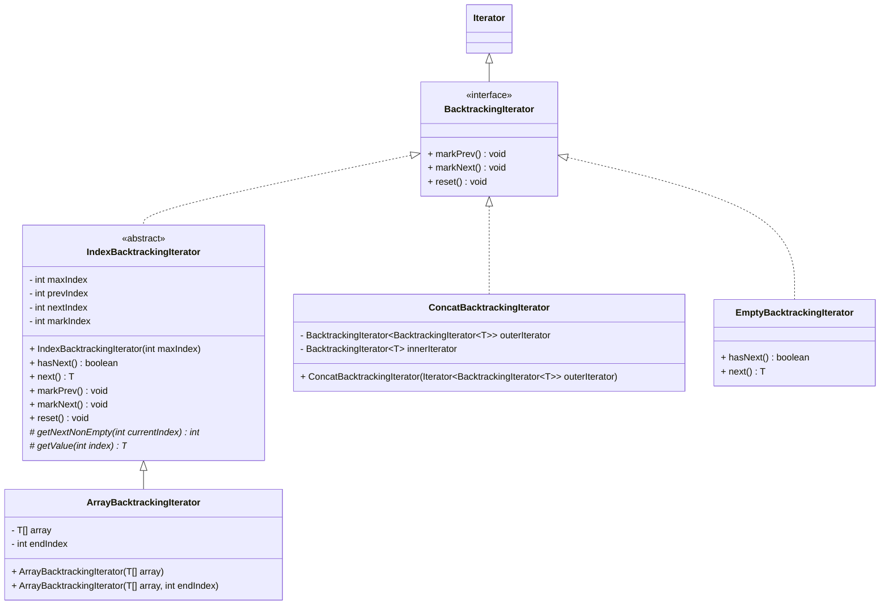
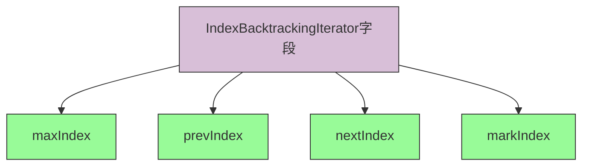

# Iterator API 文档

## 回溯迭代器类结构图



## 核心API说明

### IndexBacktrackingIterator 抽象类

IndexBacktrackingIterator 是专门为可以通过索引访问的数据结构设计的抽象类。

#### 核心字段



- `maxIndex`: 集合的最大索引值
- `prevIndex`: 上一个要返回元素的索引
- `nextIndex`: 下一个要返回元素的索引
- `markIndex`: 标记位置的索引

#### 构造函数

**IndexBacktrackingIterator(int maxIndex)**
```java
/**
 * 构造函数，需要输入最大索引值
 * @param maxIndex 集合的最大索引值
 */
public IndexBacktrackingIterator(int maxIndex) {
    this.maxIndex = maxIndex;
    this.prevIndex = -1;
    this.nextIndex = -1;
    this.markIndex = -1;
}
```

#### 抽象方法

需要子类实现的抽象方法：

1. **getNextNonEmpty(int currentIndex)**
```java
/**
 * 获取下一个非空值的索引
 * @param currentIndex 当前索引
 * @return 下一个非空值的索引
 */
protected abstract int getNextNonEmpty(int currentIndex);
```

2. **getValue(int index)**
```java
/**
 * 获取指定索引的值
 * @param index 索引
 * @return 指定索引的值
 */
protected abstract T getValue(int index);
```

#### 模板方法

已经实现的模板方法：

1. **hasNext()**
```java
/**
 * 检查是否有下一个元素
 * 首次调用会调用getNextNonEmpty获取下一个索引值，然后判断nextIndex < maxIndex
 */
@Override
public boolean hasNext() {
    if (this.nextIndex == -1) this.nextIndex = getNextNonEmpty(nextIndex);
    return this.nextIndex < this.maxIndex;
}
```

2. **next()**
```java
/**
 * 获取下一个元素，会记录状态。牢记：prevIndex, nextIndex, markIndex, maxIndex
 */
@Override
public T next() {
    if (!this.hasNext()) throw new NoSuchElementException();
    T value = getValue(this.nextIndex);
    this.prevIndex = this.nextIndex;
    this.nextIndex = this.getNextNonEmpty(this.nextIndex);
    return value;
}
```

3. **markPrev()**
```java
/**
 * 标记上一个元素位置。即：markIndex = prevIndex，如果没有prevIndex就直接返回
 */
@Override
public void markPrev() {
    if (prevIndex == -1) return;
    this.markIndex = this.prevIndex;
}
```

4. **markNext()**
```java
/**
 * 标记下一个元素位置。即：markIndex = nextIndex
 */
@Override
public void markNext() {
    if (hasNext()) markIndex = nextIndex;
}
```

5. **reset()**
```java
/**
 * 重置，即nextIndex = markIndex
 */
@Override
public void reset() {
    if (this.markIndex == -1) return;
    this.prevIndex = -1;
    this.nextIndex = this.markIndex;
}
```

### ArrayBacktrackingIterator 数组回溯迭代器

ArrayBacktrackingIterator 是 IndexBacktrackingIterator 的具体实现，用于数组数据结构。

#### 核心字段

- `array`: 内部数组
- `endIndex`: 结束索引

#### 构造函数

1. **ArrayBacktrackingIterator(T[] array)**
```java
/**
 * 构造函数
 * @param array 内部数组
 */
public ArrayBacktrackingIterator(T[] array) {
    super(array.length);
    this.array = array;
    this.endIndex = array.length;
}
```

2. **ArrayBacktrackingIterator(T[] array, int endIndex)**
```java
/**
 * 构造函数
 * @param array 内部数组
 * @param endIndex 结束索引
 */
public ArrayBacktrackingIterator(T[] array, int endIndex) {
    super(endIndex);
    this.array = array;
    this.endIndex = endIndex;
}
```

### ConcatBacktrackingIterator 合并迭代器

ConcatBacktrackingIterator 用于连接多个可迭代对象，将它们扁平化为单一的迭代器。

#### 核心字段

- `outerIterator`: 产生可迭代对象的外部迭代器
- `innerIterator`: 当前处理的内部迭代器

#### 构造函数

**ConcatBacktrackingIterator(Iterator<BacktrackingIterator<T>> outerIterator)**
```java
/**
 * 构造函数
 * @param outerIterator 产生可迭代对象的外部迭代器
 */
public ConcatBacktrackingIterator(Iterator<BacktrackingIterator<T>> outerIterator) {
    this.outerIterator = outerIterator;
    this.innerIterator = null;
}
```

### EmptyBacktrackingIterator 空迭代器

EmptyBacktrackingIterator 是一个始终为空的迭代器实现。

#### 核心方法

1. **hasNext()**
```java
/**
 * 始终返回false
 */
@Override
public boolean hasNext() {
    return false;
}
```

2. **next()**
```java
/**
 * 直接抛出NoSuchElementException异常
 */
@Override
public T next() {
    throw new NoSuchElementException();
}
```

## 使用示例

```java
// 数组回溯迭代器使用示例
String[] data = {"A", "B", "C", "D", "E"};
ArrayBacktrackingIterator<String> iterator = new ArrayBacktrackingIterator<>(data);

// 遍历元素
while (iterator.hasNext()) {
    String value = iterator.next();
    System.out.println(value);
    
    // 标记当前位置
    if ("C".equals(value)) {
        iterator.markNext();
    }
}

// 重置到标记位置
iterator.reset();

// 合并迭代器使用示例
List<List<String>> lists = Arrays.asList(
    Arrays.asList("A", "B"),
    Arrays.asList("C", "D"),
    Arrays.asList("E", "F")
);

// 将列表转换为迭代器列表
List<BacktrackingIterator<String>> iterators = lists.stream()
    .map(list -> new ArrayBacktrackingIterator<>(list.toArray(new String[0])))
    .collect(Collectors.toList());

// 创建合并迭代器
ConcatBacktrackingIterator<String> concatIterator = 
    new ConcatBacktrackingIterator<>(iterators.iterator());

// 遍历所有元素
while (concatIterator.hasNext()) {
    String value = concatIterator.next();
    System.out.println(value); // 输出: A, B, C, D, E, F
}
```