# QueryOperator API 文档

## QueryOperator 类结构图

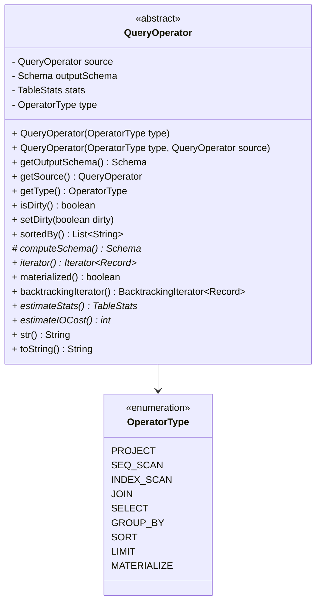

## 核心API说明

### 构造函数

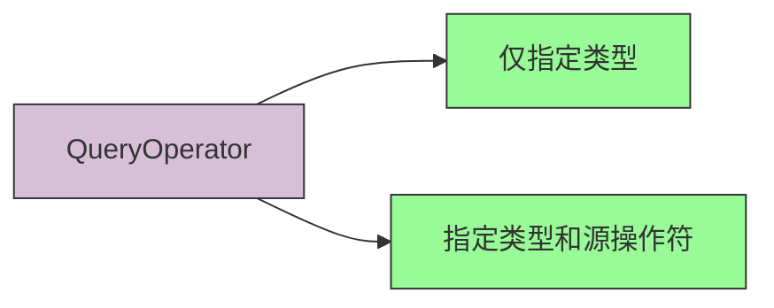

1. **基础构造函数**
```java
/**
 * 创建一个仅有类型的算子
 * @param type 操作符类型
 */
public QueryOperator(OperatorType type){}
```

2. **带源操作符的构造函数**
```java
/**
 * 创建一个设置了源的算子，计算输出模式
 * @param type 操作符类型
 * @param source 源操作符
 */
protected QueryOperator(OperatorType type, QueryOperator source) {}
```

### 抽象方法

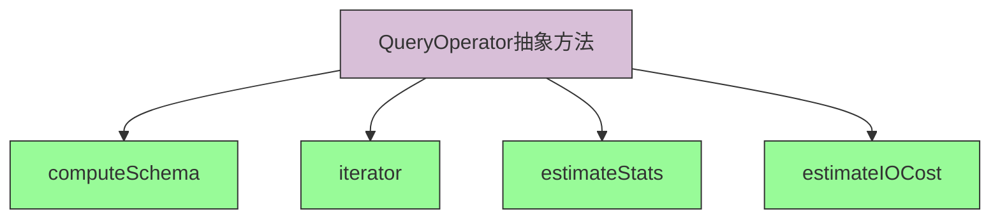

1. **computeSchema()** - 计算操作符的输出模式
```java
/**
 * 计算操作符的输出模式
 * @return 输出的Schema
 */
protected abstract Schema computeSchema();
```

2. **iterator()** - 获取操作符的迭代器
```java
/**
 * 获取操作符的迭代器
 * @return Record迭代器
 */
public abstract Iterator<Record> iterator();
```

3. **estimateStats()** - 估计操作符执行结果的统计信息
```java
/**
 * 估计执行此查询操作符的结果的表统计信息。
 * @return 估计的TableStats
 */
public abstract TableStats estimateStats();
```

4. **estimateIOCost()** - 估计执行操作符的IO成本
```java
/**
 * 估计执行此查询操作符的IO成本。
 * @return 估计的IO操作次数
 */
public abstract int estimateIOCost();
```

### 重要方法

1. **materialized()** - 是否物化
```java
/**
 * @return 如果此查询操作符的记录物化在表中则返回true。
 */
public boolean materialized() {
    return false;
}
```

2. **backtrackingIterator()** - 获取回溯迭代器
```java
/**
 * @throws UnsupportedOperationException 如果此操作符不支持回溯
 * @return 此操作符记录的回溯迭代器
 */
public BacktrackingIterator<Record> backtrackingIterator() {
    throw new UnsupportedOperationException(
        "此操作符不支持回溯。您可能想要先使用QueryOperator.materialize。"
    );
}
```

### 静态工具方法

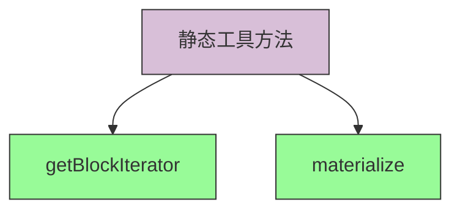

1. **getBlockIterator()** - 获取块迭代器
```java
/**
 * 从一个记录迭代器中提取指定页数的记录，并返回一个支持回溯的迭代器
 * @param records 输入的记录迭代器（数据源）
 * @param schema 记录的模式
 * @param maxPages 要消耗的记录的最大页数
 * @return 支持回溯的迭代器
 */
public static BacktrackingIterator<Record> getBlockIterator(Iterator<Record> records, Schema schema, int maxPages) {
    int recordsPerPage = Table.computeNumRecordsPerPage(PageDirectory.EFFECTIVE_PAGE_SIZE, schema);
    int maxRecords = recordsPerPage * maxPages;
    List<Record> blockRecords = new ArrayList<>();
    for (int i = 0; i < maxRecords && records.hasNext(); i++) {
        blockRecords.add(records.next());
    }
    return new ArrayBacktrackingIterator<>(blockRecords);
}
```

2. **materialize()** - 物化操作符
```java
/**
 * 物化一个查询操作符，有一些操作符不支持回溯，物化了就可以回溯了
 * @param operator 要物化的查询操作符
 * @param transaction 物化表将在其中创建的事务
 * @return 从operator记录中提取的新MaterializedOperator
 */
public static QueryOperator materialize(QueryOperator operator, TransactionContext transaction) {
    if (!operator.materialized()) {
        return new MaterializeOperator(operator, transaction);
    }
    return operator;
}
```

## JoinOperator 类结构图

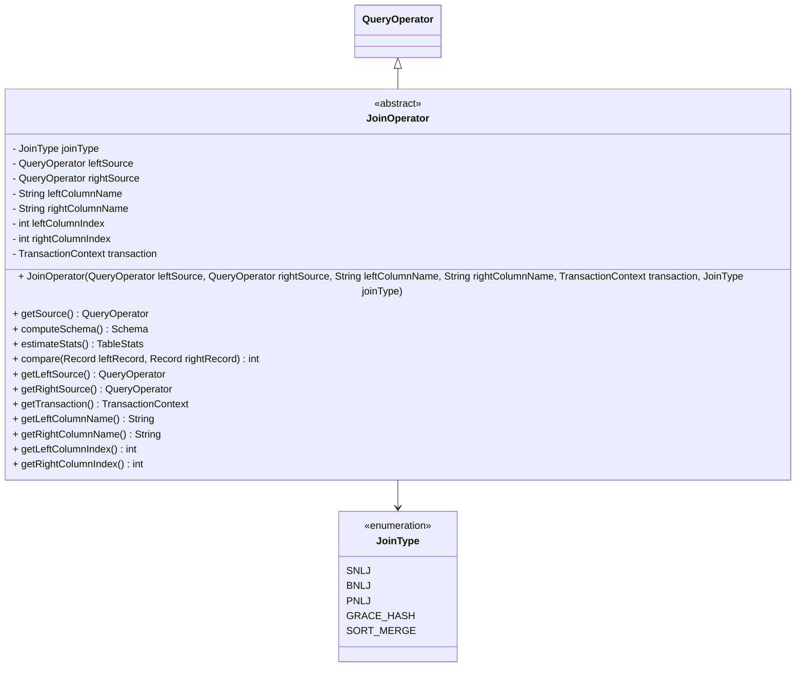

### 构造函数

```java
/**
 * 连接操作符构造函数
 * @param leftSource 左源操作符
 * @param rightSource 右源操作符
 * @param leftColumnName 左连接列名
 * @param rightColumnName 右连接列名
 * @param transaction 事务上下文
 * @param joinType 连接类型
 */
public JoinOperator(
        QueryOperator leftSource,
        QueryOperator rightSource,
        String leftColumnName,
        String rightColumnName,
        TransactionContext transaction,
        JoinType joinType) {
    // 实现细节
}
```

### 核心方法

1. **compare()** - 比较左右记录的连接列值
```java
/**
 * 比较两个记录在连接列上的值
 * @param leftRecord 左记录
 * @param rightRecord 右记录
 * @return 如果匹配返回0，小于返回负值，大于返回正值
 */
public int compare(Record leftRecord, Record rightRecord) {
    DataBox leftRecordValue = leftRecord.getValue(this.leftColumnIndex);
    DataBox rightRecordValue = rightRecord.getValue(this.rightColumnIndex);
    return leftRecordValue.compareTo(rightRecordValue);
}
```

## ScanOperator 类结构图

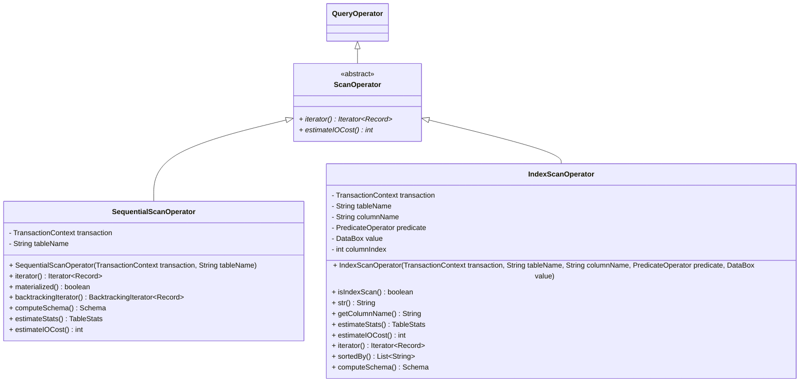

### SequentialScanOperator

#### 构造函数
```java
/**
 * 创建一个基表的扫描操作符
 * @param transaction 事务上下文
 * @param tableName 表名
 */
public SequentialScanOperator(TransactionContext transaction, String tableName) {
    // 实现细节
}
```

#### 核心API
- **iterator()**: 获取回溯迭代器
- **materialized()**: 返回true，是物化操作符
- **backtrackingIterator()**: 通过事务上下文获取可回溯迭代器
- **computeSchema()**: 通过事务上下文获取结果表的模式
- **estimateStats()**: 通过事务上下文获取结果表的统计信息
- **estimateIOCost()**: 通过事务上下文获取结果表的IO成本

### IndexScanOperator

#### 构造函数
```java
/**
 * 索引扫描操作符
 * @param transaction 包含此操作符的事务
 * @param tableName 要迭代的表
 * @param columnName 索引所在列的名称
 * @param predicate 索引列的查询条件谓词
 * @param value 索引列的查询条件值
 */
IndexScanOperator(TransactionContext transaction,
                  String tableName,
                  String columnName,
                  PredicateOperator predicate,
                  DataBox value) {
    super(OperatorType.INDEX_SCAN);
    this.tableName = tableName;
    this.transaction = transaction;
    this.columnName = columnName;
    this.predicate = predicate;
    this.value = value;
    this.setOutputSchema(this.computeSchema());
    this.columnIndex = this.getSchema().findField(columnName);
    this.stats = this.estimateStats();
}
```

#### 核心API
- **estimateStats()**: 通过事务上下文获取结果表的统计信息
- **estimateIOCost()**: 通过事务上下文获取结果表的IO成本
- **iterator()**: 获取索引扫描迭代器
- **sortedBy()**: 返回排序列名列表
- **computeSchema()**: 通过事务上下文获取结果表的模式

## 特殊算子

### SelectOperator
选择算子，是流式算子
项目的选择算子只实现了单个谓词的选择。
属性包括: attribute op value as(name = 'Tom')
- 属性在Schema列表中的位置
- 属性名
- 谓词
- 值

#### 类结构图

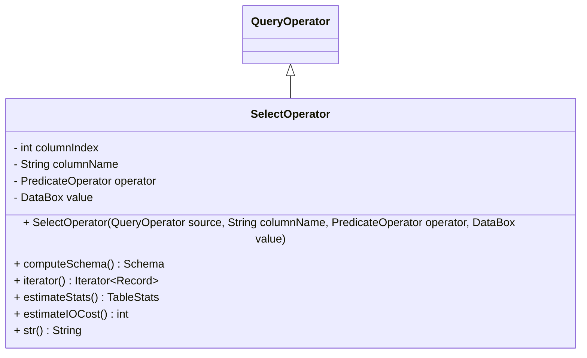

#### 构造函数
```java
/**
 * 创建一个新的SelectOperator，它从source中获取数据，
 * 并只返回满足谓词条件的元组。
 *
 * @param source 该操作符的数据源
 * @param columnName 需要评估谓词的列名
 * @param operator 实际的比较器
 * @param value 要比较的值
 */
public SelectOperator(QueryOperator source,
               String columnName,
               PredicateOperator operator,
               DataBox value) {
    super(OperatorType.SELECT, source);
    this.operator = operator;
    this.value = value;

    this.columnIndex = this.getSchema().findField(columnName);
    this.columnName = this.getSchema().getFieldName(columnIndex);

    this.stats = this.estimateStats();
}
```

#### 核心API
- **computeSchema()**: 返回源操作符的Schema，因为SELECT操作不会改变表结构
- **estimateStats()**: 调用TableStats的copyWithPredicate方法来估计过滤后的统计数据
- **estimateIOCost()**: 返回源操作符的IO成本，因为SELECT是流式操作符，不增加额外IO
- **str()**: 返回格式化的字符串描述，显示选择条件

#### 内部迭代器
SelectIterator实现了一个特殊的逻辑：
- next()方法只负责返回迭代器中缓存的记录
- hasNext()方法负责从源迭代器中查找满足条件的记录并缓存
- 这种设计避免了在next()方法中进行复杂的逻辑处理

### ProjectOperator
这个是投影算子，也是流式算子，但如果有聚合函数就是阻塞算子了
注意，项目的一个记录，结构和值的列表是分开存储的
属性包括:
- 输出的属性列表
- Group By 涉及的列名
- 源操作符的模式
- 表达式列表

#### 类结构图

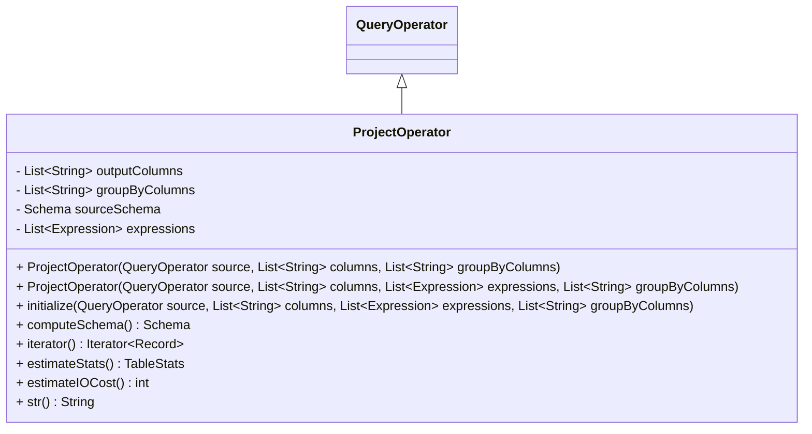

#### 构造函数
有两个构造函数：
1. 接收列名列表，内部使用Expression.fromString()将字符串转换为表达式对象
2. 直接接收表达式对象列表

两种构造函数都会调用initialize方法进行初始化。

#### 核心API
- **initialize()**: 初始化方法，设置各种属性并验证聚合表达式的合法性
- **computeSchema()**: 计算输出Schema，基于表达式列表确定各列的类型
- **estimateStats()**: 返回源操作符的统计信息
- **estimateIOCost()**: 返回源操作符的IO成本
- **str()**: 返回格式化的字符串描述，显示投影的列

#### 关键特性
1. 支持普通投影和聚合投影
2. 当存在聚合函数时，会验证非聚合表达式只能引用GROUP BY中的列
3. 使用Expression对象来处理复杂的表达式计算

### SortOperator
阻塞操作符，进行排序，按排序顺序返回源操作符中的记录
属性:
- 比较器
- 事务上下文
- 有序段 RUN
- 缓冲区 个数
- 排序字段在Schema中的位置
- 排序字段名

#### 类结构图

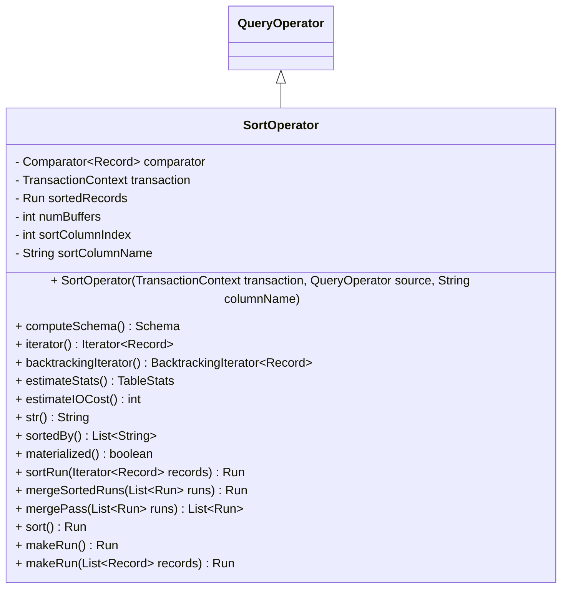

#### 构造函数
```java
public SortOperator(TransactionContext transaction, QueryOperator source,
                    String columnName) {
    super(OperatorType.SORT, source);
    this.transaction = transaction;
    this.numBuffers = this.transaction.getWorkMemSize();
    this.sortColumnIndex = getSchema().findField(columnName);
    this.sortColumnName = getSchema().getFieldName(this.sortColumnIndex);
    this.comparator = new RecordComparator();
}
```

#### 核心API
- **computeSchema()**: 返回源操作符的Schema
- **iterator()**: 返回回溯迭代器
- **backtrackingIterator()**: 返回排序后的记录迭代器，如果尚未排序则先执行排序
- **estimateStats()**: 返回源操作符的统计信息
- **estimateIOCost()**: 使用外部排序算法计算IO成本
- **str()**: 返回格式化的字符串描述
- **sortedBy()**: 返回排序字段名列表
- **materialized()**: 返回true，因为排序操作会物化结果

#### 外部排序相关方法
- **sortRun()**: 对输入记录进行内存内排序，返回一个已排序的Run
- **mergeSortedRuns()**: 合并多个已排序的Run
- **mergePass()**: 执行一轮合并操作，每次合并(numBuffers-1)个Run
- **sort()**: 执行完整的外部归并排序
- **makeRun()**: 创建一个新的空Run或包含指定记录的Run

## 其它操作符

### MaterializeOperator
将源操作符立即物化到一个临时表中，然后作为对临时表的顺序扫描来执行。
主要用于测试中以控制I/O 发生的时间。

#### 类结构图

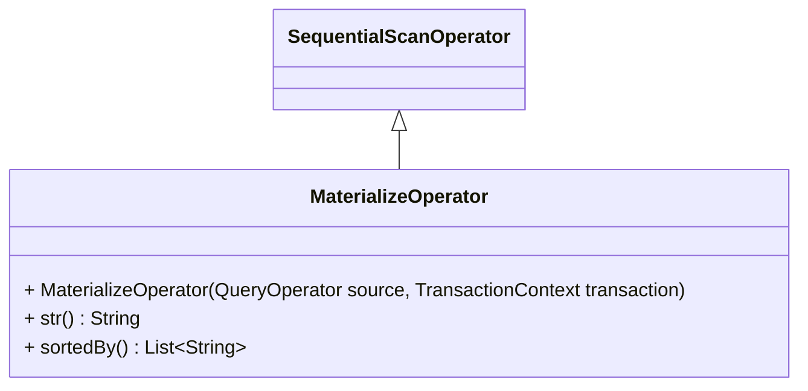

#### 构造函数
```java
/**
 * 将源操作符立即物化到临时表中的操作符，
 * 然后作为临时表上的顺序扫描操作符。
 * @param source 要物化的源操作符
 * @param transaction 当前运行的事务
 */
public MaterializeOperator(QueryOperator source,
                    TransactionContext transaction) {
    super(OperatorType.MATERIALIZE, transaction, materializeToTable(source, transaction));
    setSource(source);
    setOutputSchema(source.getSchema());
}
```

#### 核心特点
- 继承自SequentialScanOperator
- 在构造时立即将源操作符的所有记录物化到临时表中
- 提供了对物化结果的顺序扫描访问

### GroupByOperator
此操作符接受一个列名，并返回源操作符的记录，但这些记录按其值分组，每组之间用一个标记记录分隔。

#### 类结构图

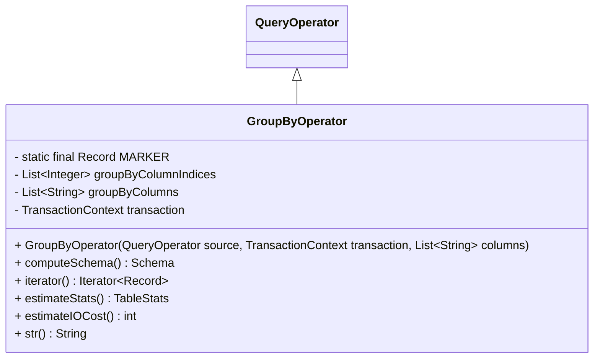

#### 构造函数
```java
/**
 * Create a new GroupByOperator that pulls from source and groups by groupByColumn.
 *
 * @param source the source operator of this operator
 * @param transaction the transaction containing this operator
 * @param columns the columns to group on
 */
GroupByOperator(QueryOperator source,
                TransactionContext transaction,
                List<String> columns) {
    super(OperatorType.GROUP_BY, source);
    Schema sourceSchema = this.getSource().getSchema();
    this.transaction = transaction;
    this.groupByColumns = new ArrayList<>();
    this.groupByColumnIndices = new ArrayList<>();
    for (String column: columns) {
        this.groupByColumns.add(sourceSchema.matchFieldName(column));
    }
    for (String groupByColumn: this.groupByColumns) {
        this.groupByColumnIndices.add(sourceSchema.getFieldNames().indexOf(groupByColumn));
    }

    this.stats = this.estimateStats();
}
```

#### 核心API
- **computeSchema()**: 返回源操作符的Schema
- **iterator()**: 返回GroupByIterator迭代器
- **estimateStats()**: 返回源操作符的统计信息
- **estimateIOCost()**: 使用外部排序的成本模型计算IO成本
- **str()**: 返回格式化的字符串描述

#### 核心特点
- 实现了基于哈希的分组策略
- 将相同分组的记录存储在临时表中
- 在不同组之间插入MARKER记录来标识分组边界
- IO成本计算基于外部排序算法