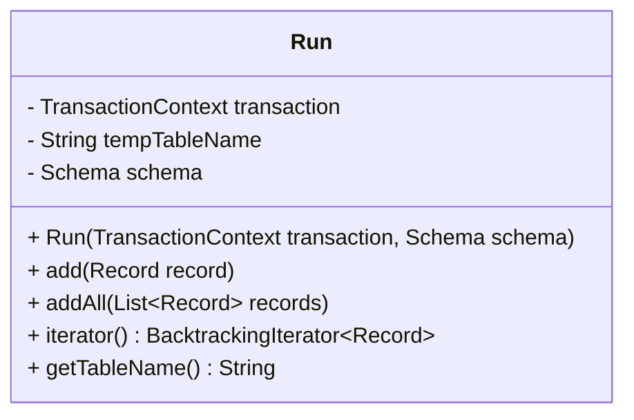
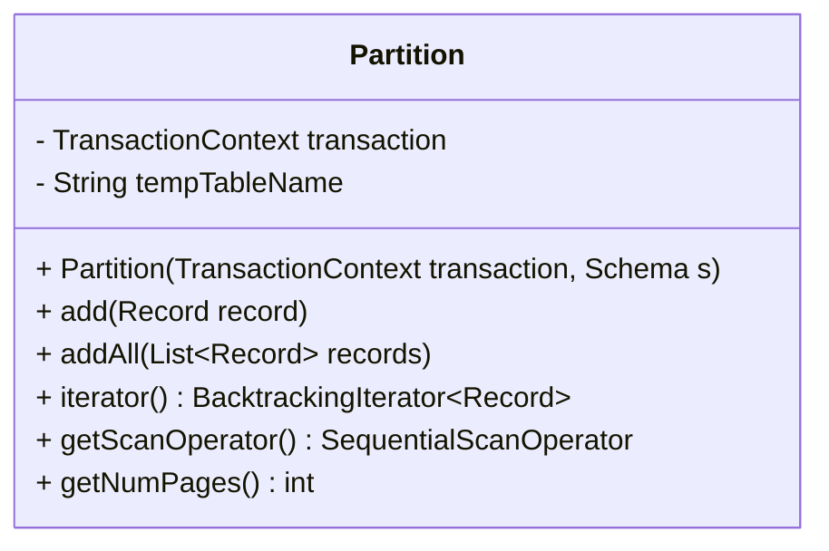

## 两个关键的类

### RUN.class

Run类表示磁盘上的一段空间，我们可以向其中追加记录或从中读取记录。这对于外部排序非常有用，可以在不使用记录时将其存储起来以释放内存。自动缓冲读写操作以最小化产生的I/O操作。

#### 类结构图

#### 核心功能

1. **构造函数**
   - 接收一个TransactionContext和Schema作为参数
   - 不会立即创建临时表，而是在第一次添加记录时创建

2. **add方法**
   - 向Run中添加单条记录
   - 如果是第一次添加记录，会创建一个临时表来存储记录

3. **addAll方法**
   - 向Run中添加一组记录
   - 通过循环调用add方法实现

4. **iterator方法**
   - 返回Run中记录的迭代器
   - 是一个回溯迭代器
   - 如果Run为空（没有添加过记录），返回一个空的回溯迭代器

5. **getTableName方法**
   - 返回用于存储记录的临时表名

#### 使用场景

Run主要用于外部排序算法中，当数据量太大无法全部放入内存时，可以将部分数据写入磁盘上的Run中，待需要时再读取回来。

### Partition.class

Partition类也表示磁盘上的一段空间，我们可以向其中追加记录或从中读取记录。这在外部哈希中很有用，可以存储我们不使用的记录并释放内存。自动缓冲读写操作以最小化产生的I/O操作。

#### 类结构图

#### 核心功能

1. **构造函数**
   - 接收一个TransactionContext和Schema作为参数
   - 立即创建一个临时表来存储记录

2. **add方法**
   - 向Partition中添加单条记录

3. **addAll方法**
   - 向Partition中添加一组记录
   - 通过循环调用add方法实现

4. **iterator方法**
   - 返回Partition中记录的迭代器

5. **getScanOperator方法**
   - 返回在此分区支持的临时表上的顺序扫描操作符
   - 可以方便地将Partition集成到查询计划中

6. **getNumPages方法**
   - 返回用于存储此分区中记录的页数
   - 用于成本估计和内存管理

#### 使用场景

Partition主要用于外部哈希连接算法中，当数据量太大无法全部放入内存时，可以将数据分区存储在磁盘上，然后分别处理各个分区。

#### Run与Partition的区别

1. **初始化时机**：
   - Run在第一次添加记录时才创建临时表
   - Partition在构造时立即创建临时表

2. **功能差异**：
   - Partition提供了getScanOperator方法，可以直接生成扫描操作符
   - Partition提供了getNumPages方法，可以获取占用的页数信息

3. **应用场景**：
   - Run主要用于外部排序
   - Partition主要用于外部哈希连接