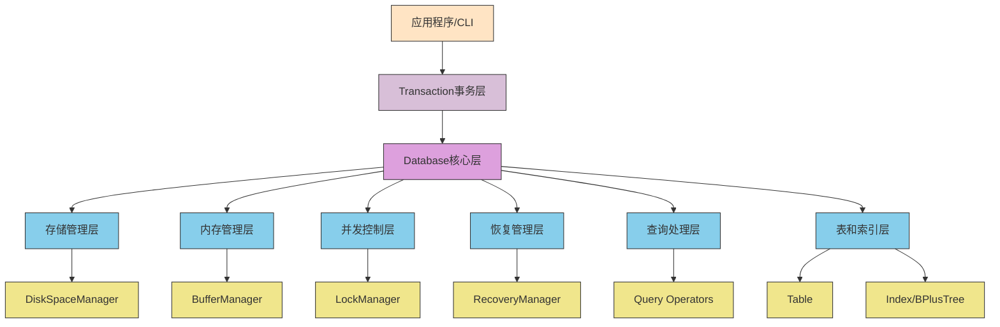

# 分层架构图

## 架构层次说明

### 应用层 (Application Layer)
- 用户交互入口，包括命令行界面和服务器接口
- 负责解析用户输入并转换为系统内部调用

### 事务层 (Transaction Layer)
- 提供面向用户的统一操作接口
- 管理事务的生命周期（开始、提交、回滚）

### 核心数据库层 (Database Core Layer)
- 数据库系统的核心协调者
- 管理各个子系统的初始化和协作

### 子系统层 (Subsystems Layer)
- **存储管理层**: 管理磁盘空间分配和回收
- **内存管理层**: 管理缓冲区和页面置换策略
- **并发控制层**: 实现锁机制保证并发安全性
- **恢复管理层**: 实现日志和恢复机制保证持久性
- **查询处理层**: 实现各种查询操作符
- **表和索引层**: 实现表结构和索引机制