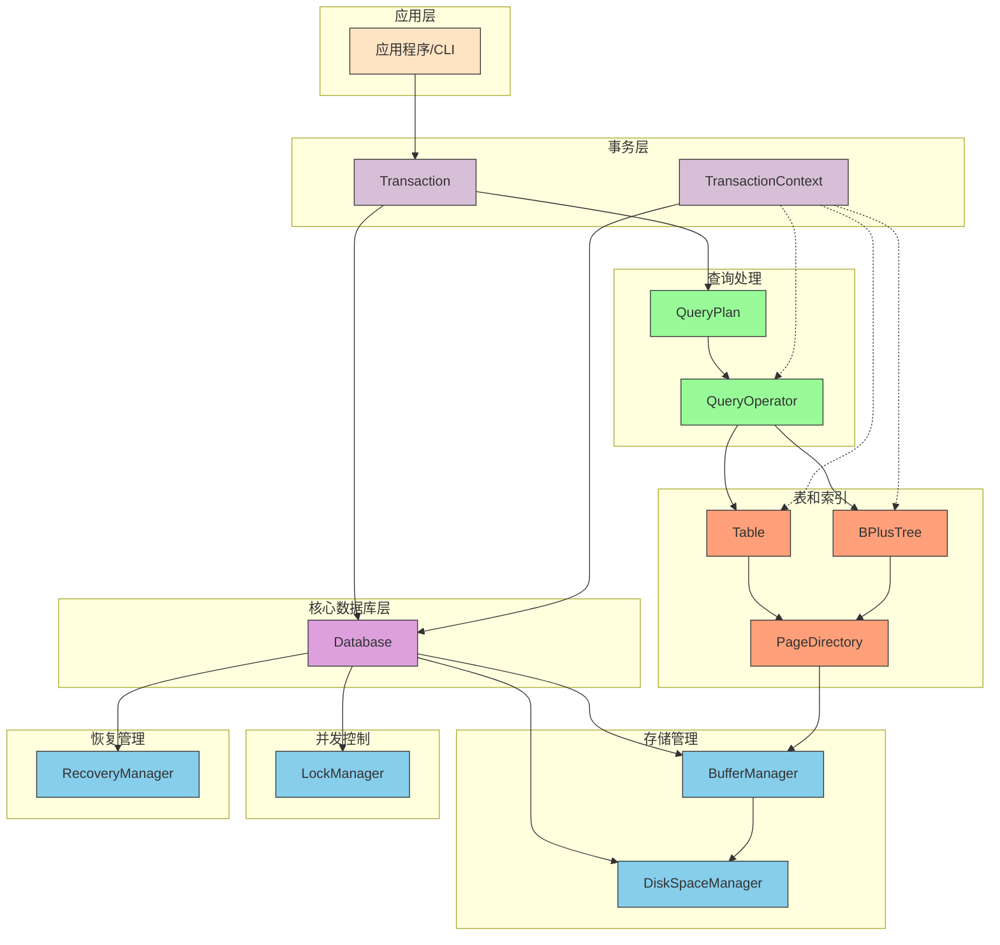

# 组件依赖图

## 组件依赖关系说明

### 分层依赖关系
- **应用层**：用户交互入口，通过Transaction接口与系统交互
- **事务层**：提供统一的操作接口，管理事务生命周期
- **核心数据库层**：系统核心协调者，统筹管理所有子系统
- **子系统层**：包括存储管理、并发控制、恢复管理、查询处理和表索引五大模块

### Database的核心作用
Database作为整个系统的中心枢纽，直接管理以下核心组件：
1. **DiskSpaceManager**：负责磁盘空间分配和管理
2. **BufferManager**：负责缓冲区管理和页面置换
3. **LockManager**：负责并发控制和锁管理
4. **RecoveryManager**：负责日志记录和系统恢复

Database通过这些组件协调整个数据库系统的运作，而不是直接处理查询逻辑。

### 核心数据流
1. 应用层通过Transaction调用Database核心
2. Database协调各个子系统工作
3. Transaction通过QueryPlan驱动查询操作符执行
4. QueryOperator通过TransactionContext访问表和索引数据
5. 底层存储访问链：Table/BPlusTree → PageDirectory → BufferManager → DiskSpaceManager

### 依赖线条说明
- 实线表示直接依赖关系
- 虚线表示间接依赖或调用关系