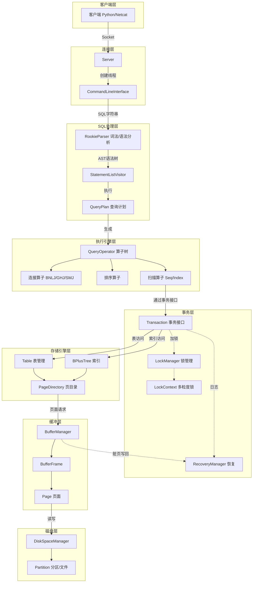
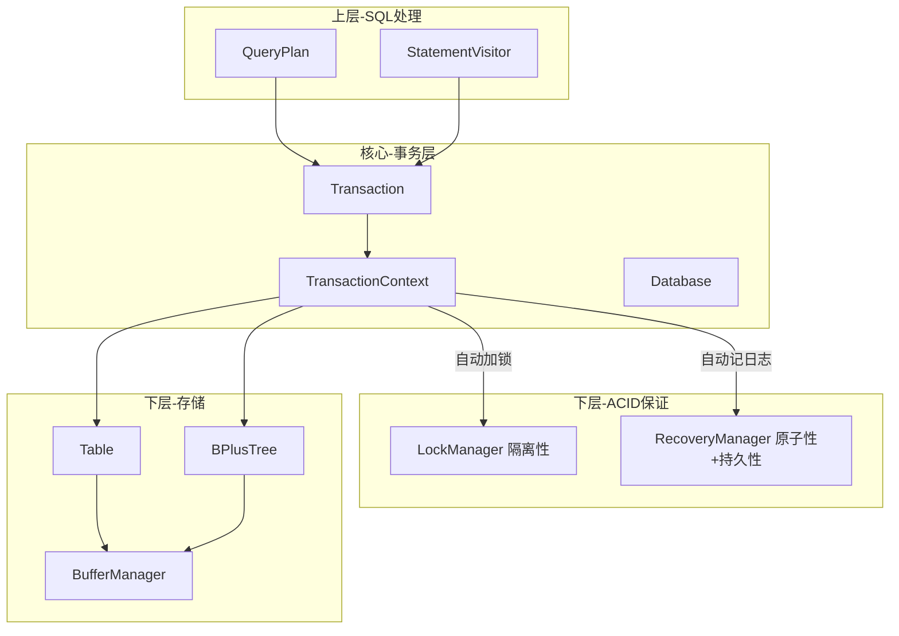
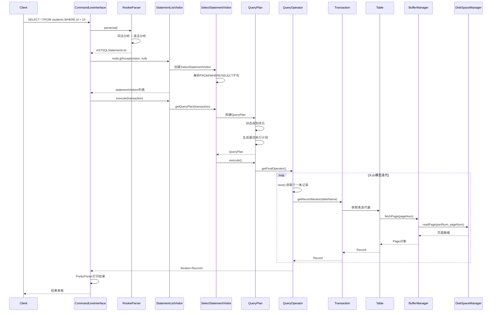
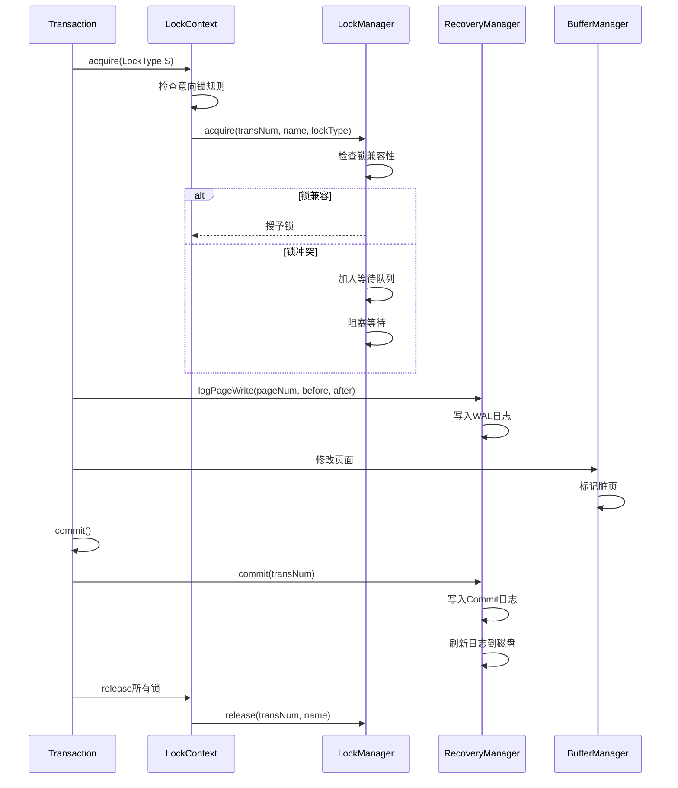

# RookieDB 顶层视角与调用链

## 系统架构总览



## 核心组件职责

| 层次 | 核心类 | 职责 |
|------|--------|------|
| 连接层 | Server, CLI | 接收客户端连接，创建会话，REPL循环 |
| 解析层 | RookieParser, Visitor | SQL词法语法分析，生成AST，遍历执行 |
| 优化执行层 | QueryPlan, QueryOperator | 查询优化，生成执行计划，火山模型执行 |
| **事务层** | **Transaction, TransactionContext** | **核心枢纽：封装ACID，协调并发和恢复** |
| 索引表层 | BPlusTree, Table | B+树索引，表记录管理 |
| 并发控制层 | LockManager, LockContext | 多粒度锁，2PL协议 |
| 恢复层 | RecoveryManager | ARIES算法，WAL日志 |
| 缓冲层 | BufferManager, Page | 页面缓存，淘汰策略 |
| 磁盘层 | DiskSpaceManager | 分区/页面分配，文件I/O |

## 事务层 - 系统核心枢纽

事务层是整个存储引擎的**中心协调者**，它连接了上层SQL处理和底层存储：



**事务层的关键职责**：
1. **统一接口**: 为上层提供DDL/DML操作接口
2. **ACID封装**: 自动处理加锁和日志记录
3. **生命周期管理**: 管理事务的开始、提交、回滚
4. **资源协调**: 协调LockManager和RecoveryManager

## 一条SQL的完整执行链路



## 事务与并发控制流程



## 关键设计模式

### 1. Visitor模式 - SQL解析执行
```
AST节点.jjtAccept(visitor) → visitor.visit(节点) → 执行对应逻辑
```
- **优点**: 将遍历逻辑与节点结构分离，易于扩展新操作

### 2. Iterator模式 - 火山模型
```
TopOperator.next() → ChildOperator.next() → ... → ScanOperator.next()
```
- **优点**: 惰性求值，流水线执行，内存高效

### 3. 分层抽象 - 事务接口
```
上层(QueryPlan) → Transaction接口 → 下层(Table/Index/Lock/Recovery)
```
- **优点**: 隔离底层实现，统一事务语义

### 4. 策略模式 - 可插拔组件
```
BufferManager + EvictionPolicy(LRU/Clock)
Database + RecoveryManager(ARIES/Dummy)
Database + LockManager(2PL/Dummy)
```
- **优点**: 运行时可选择不同策略

## 为什么通过Transaction接口访问表？

这是一个关键设计决策：

1. **事务语义封装**: Transaction封装了对表的所有访问，确保每次操作都在事务上下文中
2. **并发控制**: Transaction内部会自动调用LockContext获取必要的锁
3. **日志记录**: 所有修改操作会自动记录到WAL日志
4. **统一接口**: 上层只需要通过Transaction接口，不需要直接操作Table/Index

```java
// Transaction.query() 实际做了什么:
public QueryPlan query(String tableName) {
    // 1. 获取表的锁
    LockUtil.ensureSufficientLockHeld(tableContext, LockType.S);
    // 2. 返回查询计划构建器
    return new QueryPlan(this, tableName);
}
```

## 面试关键问题

### Q1: 描述一条SQL从输入到输出的完整流程

以 `SELECT * FROM students WHERE id > 10` 为例：

1. **连接层** → Client通过Socket连接Server，Server为每个连接创建`ClientThread`和`CommandLineInterface`
2. **解析层** → `RookieParser`（由JavaCC生成）进行词法/语法分析，生成AST语法树
3. **调度层** → `StatementListVisitor`遍历AST，根据节点类型创建`SelectStatementVisitor`
4. **优化层** → `QueryPlan`使用动态规划找到成本最低的左深连接树
5. **执行层** → 火山模型：从根算子开始调用`next()`，逐层向下拉取数据
6. **事务层** → 通过`Transaction`接口访问表，自动获取锁、记录日志
7. **存储层** → `Table`通过`PageDirectory`定位记录，`BufferManager`缓存页面
8. **磁盘层** → `DiskSpaceManager`读写物理文件
9. **返回** → 记录逐条向上传递，`PrettyPrinter`格式化输出

---

### Q2: 为什么使用Visitor模式处理SQL？

**核心原因：分离结构与操作**
- AST结构稳定（SELECT/INSERT/CREATE等节点类型固定）
- 操作多变（执行、优化、打印、验证等）

**RookieDB中的应用**：
```
AST节点.jjtAccept(visitor) → visitor.visit(节点) → 执行对应逻辑
```

**优点**：
1. 新增操作只需新增Visitor类，不修改AST
2. 类型安全，每种语句有专门的visit方法
3. 遍历逻辑集中管理，易于调试

---

### Q3: 火山模型的优缺点是什么？

**优点**：
1. **惰性求值** - 按需获取记录，不需要全部物化中间结果
2. **流水线执行** - 上层算子可以边处理边拉取，减少等待
3. **内存高效** - 一次只处理少量记录，适合大数据集
4. **代码简洁** - 每个算子只关心自己的`next()`逻辑

**缺点**：
1. **虚函数开销** - 每条记录都要调用`next()`，函数调用频繁
2. **CPU缓存不友好** - 数据在算子间来回传递，局部性差
3. **难以向量化** - 一次处理一条记录，无法利用SIMD

**改进方向**：批处理模型（如ClickHouse）、编译执行（如Spark Tungsten）

---

### Q4: 事务接口在系统中起什么作用？

**核心枢纽，连接上下层**：
```
上层(QueryPlan) → Transaction → 下层(Table/Index/Lock/Recovery)
```

**四大职责**：
1. **统一接口** - 为SQL层提供DDL/DML操作（query, insert, update, delete）
2. **ACID封装** - 自动处理：访问数据前获取锁（通过LockContext）、修改数据时记日志（通过RecoveryManager）
3. **生命周期管理** - 管理begin/commit/rollback状态转换
4. **资源协调** - 提交时释放锁、清理临时表、通知恢复管理器

**关键设计**：`TransactionContext`通过ThreadLocal绑定到线程，内部组件可直接获取当前事务上下文

---

### Q5: 各层之间是如何解耦的？

**三种主要解耦方式**：

| 机制 | 示例 | 好处 |
|------|------|------|
| **接口抽象** | `Transaction`接口 vs `TransactionImpl`实现 | 上层不关心实现细节 |
| **策略模式** | `BufferManager` + `EvictionPolicy(LRU/Clock)` | 运行时可切换策略 |
| **依赖注入** | `Database`创建时注入各Manager | 便于测试和替换组件 |

**层次边界**：
- SQL层通过`Transaction`接口访问存储层
- 存储层通过`BufferManager`接口访问缓冲层
- 缓冲层通过`DiskSpaceManager`接口访问磁盘层

**好处**：
1. 可以独立测试每层（使用Mock）
2. 可以替换组件（如用DummyLockManager跳过锁）
3. 职责清晰，易于理解和维护
