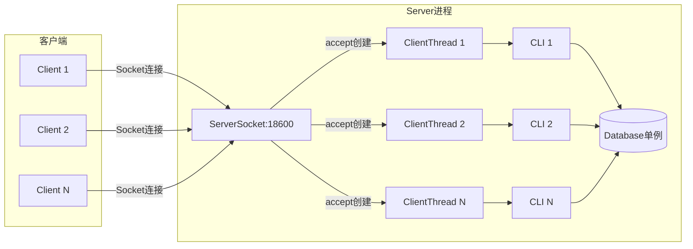

# 数据库连接层 - 面试准备方案

## 你的理解回顾
- 采用ServerSocket监听 + ClientSocket连接创建新线程的模型
- 连接建立后创建CommandLineInterface进行REPL循环

## 核心代码位置
```
/cli/Server.java          - 服务端Socket监听
/cli/CommandLineInterface.java - 客户端会话REPL
```

## 架构图



## 核心API与设计模式

### 1. 网络编程模型: BIO (Blocking I/O)
```java
// Server.java
public void listen(Database db) {
    try (ServerSocket serverSocket = new ServerSocket(this.port)) {
        while (true) {
            // accept()阻塞等待连接
            new ClientThread(serverSocket.accept(), db).start();
        }
    }
}
```

**特点**:
- 一个连接一个线程 (Thread-per-Connection)
- 简单直接，适合低并发场景
- 线程资源消耗大，不适合高并发

### 2. 线程模型: 多线程同步
```java
class ClientThread extends Thread {
    Socket socket;
    Database db;  // 所有线程共享同一个Database实例
    
    public void run() {
        CommandLineInterface cli = new CommandLineInterface(db, in, out);
        cli.run();  // REPL循环
    }
}
```

**关键点**:
- Database是共享资源，需要并发控制
- 每个CLI有独立的输入输出流
- 事务隔离通过LockManager保证

### 3. REPL模式 (Read-Eval-Print-Loop)
```java
// CommandLineInterface.run()
while (true) {
    input = bufferUserInput(inputScanner);  // Read
    node = parser.sql_stmt_list();          // Parse
    node.jjtAccept(visitor, null);          // Eval
    visitor.execute(currTransaction);        // Execute & Print
}
```

## 面试问答准备

### Q1: 你的数据库项目网络层是怎么设计的？
**A**: 采用传统的BIO模型，ServerSocket监听端口，每个客户端连接创建一个新线程处理。线程内运行REPL循环，解析执行SQL语句。所有线程共享同一个Database实例，通过锁管理器保证并发安全。

### Q2: 这种模型有什么优缺点？
**A**: 
- **优点**: 实现简单，逻辑清晰，适合教学和演示
- **缺点**: 
  - 每连接一个线程，线程资源消耗大
  - 不支持连接池复用
  - 阻塞I/O效率低

### Q3: 如何优化？可以用Netty吗？
**A**: 可以用Netty进行以下优化：
1. **NIO模型**: 用少量线程处理大量连接
2. **事件驱动**: 非阻塞I/O，提高吞吐量
3. **连接池**: 复用连接，减少建立/销毁开销
4. **协议封装**: 自定义应用层协议，支持二进制传输

```java
// Netty优化示意
EventLoopGroup bossGroup = new NioEventLoopGroup(1);
EventLoopGroup workerGroup = new NioEventLoopGroup();
ServerBootstrap b = new ServerBootstrap();
b.group(bossGroup, workerGroup)
 .channel(NioServerSocketChannel.class)
 .childHandler(new DBProtocolHandler());
```

### Q4: 如何实现用户会话管理？
**A**: 可以添加以下功能：
1. **认证机制**: 用户名密码验证
2. **会话状态**: 维护当前事务、权限上下文
3. **超时管理**: 空闲连接自动断开
4. **审计日志**: 记录用户操作

## 与商业数据库对比

| 特性 | RookieDB | MySQL | PostgreSQL |
|------|----------|-------|------------|
| 网络模型 | BIO | 多线程 + 线程池 | 进程池 |
| 连接管理 | 无 | 连接池 | 连接池 |
| 协议 | 无(文本) | MySQL Protocol | PostgreSQL Protocol |
| 认证 | 无 | 多种方式 | 多种方式 |

## 深入理解要点
1. **为什么Database是单例共享的？** - 数据库实例管理所有资源（缓冲池、磁盘、锁），必须统一管理
2. **线程安全如何保证？** - 通过LockManager的2PL协议保证事务隔离
3. **连接和事务的关系？** - 一个连接可以有多个事务（串行），当前事务由CLI维护
