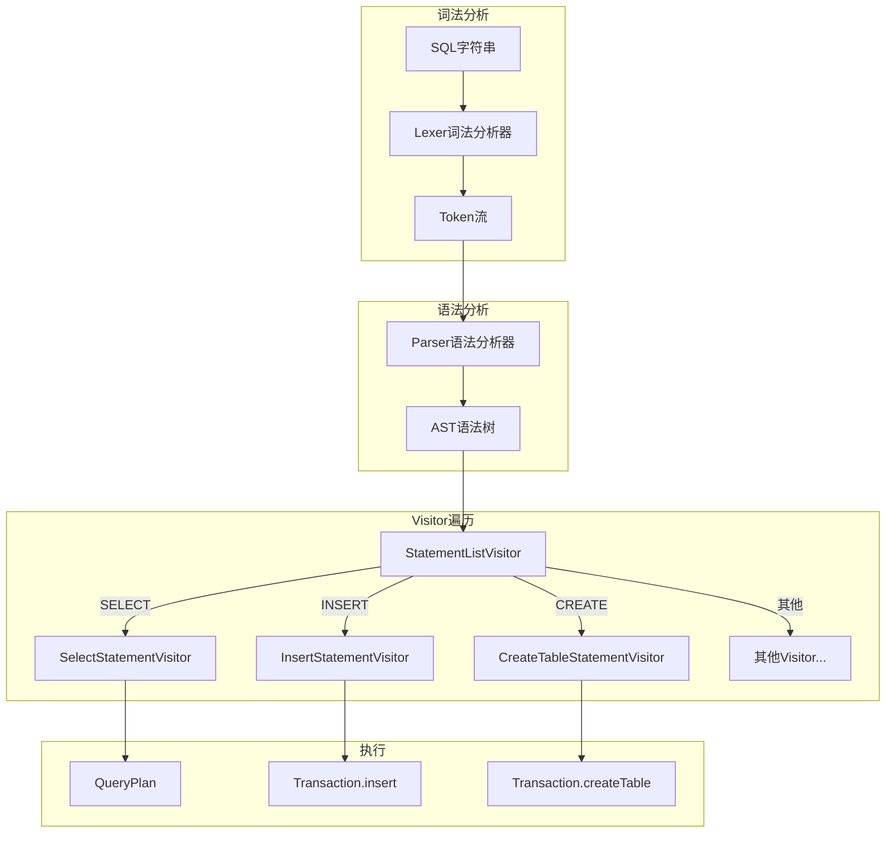
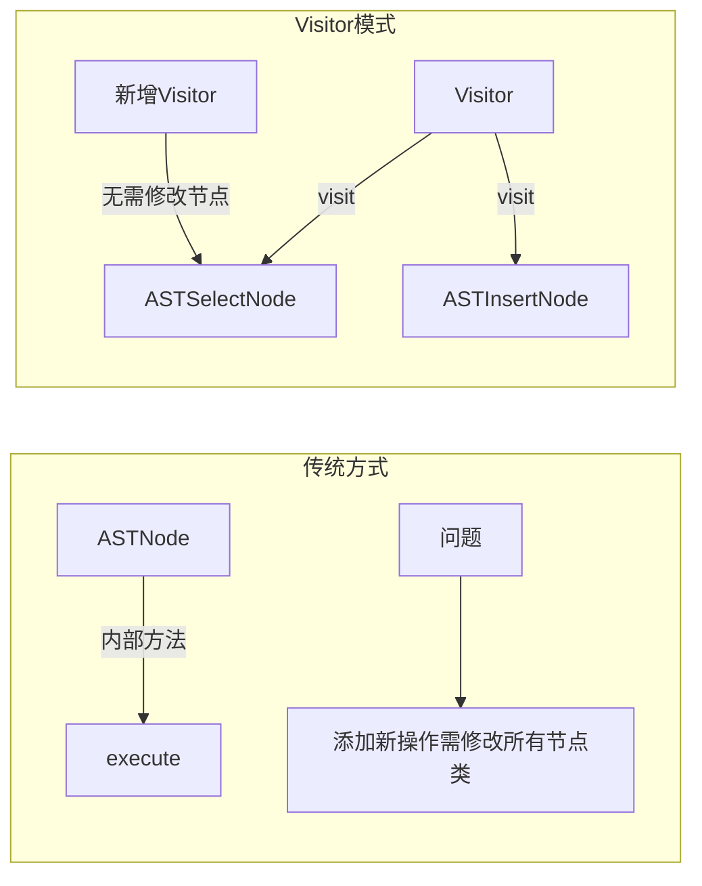

# SQL解析层 - 面试准备方案

## 你的理解回顾
- 使用JavaCC/JJTree进行词法语法设计，自动生成解析器
- 通过Visitor模式遍历AST语法树
- StatementListVisitor是核心调度器，分发给各个具体Visitor执行

## 核心代码位置
```
/cli/parser/           - JavaCC生成的解析器（自动生成，不需要深入）
/cli/visitor/          - Visitor实现（重点理解）
  ├── StatementListVisitor.java   - 主调度器
  ├── SelectStatementVisitor.java - SELECT语句
  ├── InsertStatementVisitor.java - INSERT语句
  └── ...其他语句Visitor
```

## 解析流程图



## Visitor模式详解

### 1. 为什么使用Visitor模式？



**优点**:
- 新增操作只需新增Visitor类，无需修改AST节点
- 将遍历算法与数据结构分离
- 符合开闭原则

### 2. 双重分派机制

```java
// 第一次分派: 根据节点类型调用对应accept
node.jjtAccept(visitor, data);

// AST节点内部（第二次分派）: 调用visitor的对应方法
public void jjtAccept(RookieParserVisitor visitor, Object data) {
    visitor.visit(this, data);  // this的类型决定调用哪个visit重载
}
```

### 3. StatementListVisitor的工作流程

```java
public class StatementListVisitor extends RookieParserDefaultVisitor {
    public List<StatementVisitor> statementVisitors = new ArrayList<>();
    
    // 遇到SELECT节点时
    @Override
    public void visit(ASTSelectStatement node, Object data) {
        SelectStatementVisitor visitor = new SelectStatementVisitor();
        node.childrenAccept(visitor, null);  // 让子visitor遍历子节点
        this.statementVisitors.add(visitor); // 收集visitor
    }
    
    // 统一执行所有收集的语句
    public Transaction execute(Transaction currTransaction) {
        for (StatementVisitor visitor : statementVisitors) {
            switch(visitor.getType()) {
                case SELECT:
                    QueryPlan qp = visitor.getQueryPlan(currTransaction);
                    // 执行查询...
                    break;
                case INSERT:
                    visitor.execute(currTransaction, out);
                    break;
                // ...
            }
        }
        return currTransaction;
    }
}
```

## 各Visitor作用一览

| Visitor | 触发语句 | 主要功能 |
|---------|----------|----------|
| SelectStatementVisitor | SELECT | 构建QueryPlan，执行查询 |
| InsertStatementVisitor | INSERT | 解析VALUES，调用事务插入 |
| DeleteStatementVisitor | DELETE | 解析WHERE，调用事务删除 |
| UpdateStatementVisitor | UPDATE | 解析SET/WHERE，调用事务更新 |
| CreateTableStatementVisitor | CREATE TABLE | 解析Schema，创建表 |
| CreateIndexStatementVisitor | CREATE INDEX | 创建B+树索引 |
| BeginStatementVisitor | BEGIN | 开启事务 |
| CommitStatementVisitor | COMMIT | 提交事务 |
| RollbackStatementVisitor | ROLLBACK | 回滚事务 |

## 面试问答准备

### Q1: 你的SQL解析器是怎么实现的？
**A**: 使用JavaCC/JJTree自动生成词法和语法分析器。SQL语句首先经过词法分析生成Token流，然后语法分析生成AST抽象语法树。遍历AST时采用Visitor模式，StatementListVisitor作为主调度器，根据节点类型创建对应的具体Visitor来处理不同的SQL语句。

### Q2: 为什么使用Visitor模式？
**A**: Visitor模式有以下优势：
1. **分离关注点**: 遍历逻辑与节点结构分离
2. **易于扩展**: 新增SQL语句类型只需新增Visitor类
3. **双重分派**: 根据节点类型和Visitor类型动态决定执行逻辑
4. **符合开闭原则**: 对扩展开放，对修改关闭

### Q3: StatementListVisitor的作用是什么？
**A**: StatementListVisitor是整个SQL执行的调度中心：
1. **收集阶段**: 遍历AST，为每种语句创建对应的Visitor实例
2. **执行阶段**: 统一执行所有收集的Visitor
3. **事务管理**: 处理BEGIN/COMMIT/ROLLBACK等事务控制语句

### Q4: 如果要新增一个SQL语句类型（如TRUNCATE），需要改什么？
**A**: 
1. 在.jjt文件中定义TRUNCATE的语法规则
2. 重新生成解析器代码
3. 创建TruncateStatementVisitor类
4. 在StatementListVisitor中添加对ASTTruncateStatement的visit方法

## 与其他解析器对比

| 工具 | 特点 | 使用场景 |
|------|------|----------|
| JavaCC/JJTree | 生成Java代码，语法树支持 | RookieDB |
| ANTLR | 更强大，多语言支持 | 大型编译器 |
| 手写递归下降 | 灵活，可定制 | 简单语法 |
| Calcite | SQL解析+优化框架 | 生产级数据库 |

## 深入理解要点

1. **为什么需要两层Visitor？**
   - StatementListVisitor: 识别语句类型，创建具体Visitor
   - 具体Visitor(如SelectStatementVisitor): 解析语句内部结构

2. **Parser和Visitor的职责边界？**
   - Parser: 语法正确性检查，生成AST结构
   - Visitor: 语义处理，构建执行计划

3. **PrettyPrinter.parseLiteral的作用？**
   - 将SQL字符串字面量转换为DataBox类型
   - 被多个Visitor复用（如InsertStatementVisitor、ExpressionVisitor）
