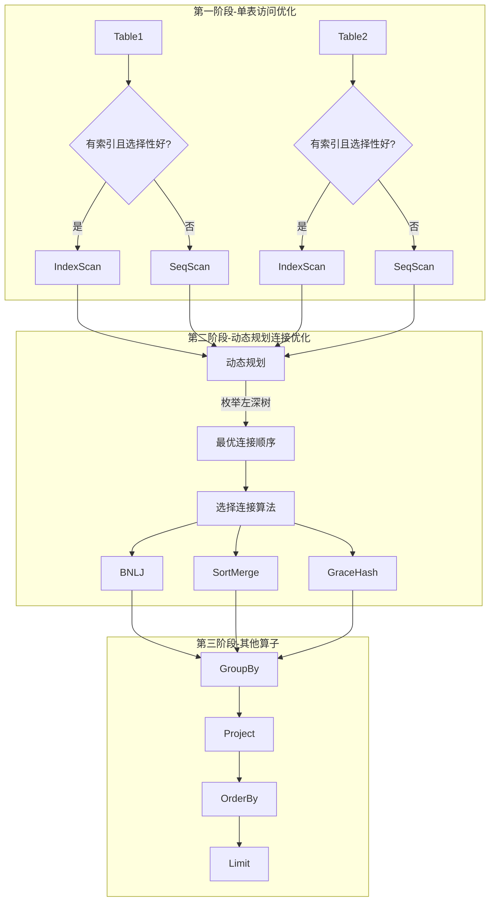
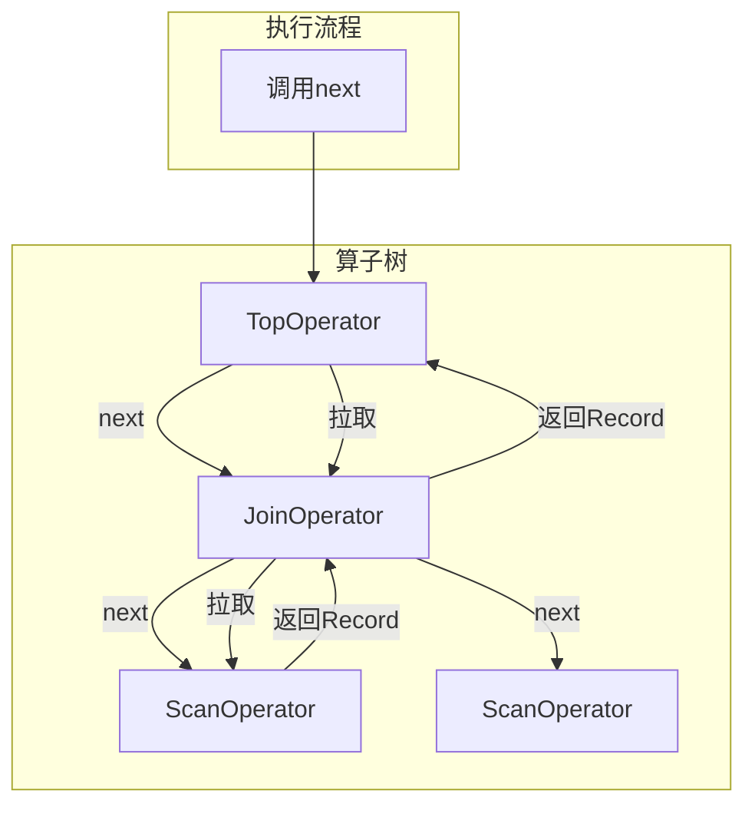
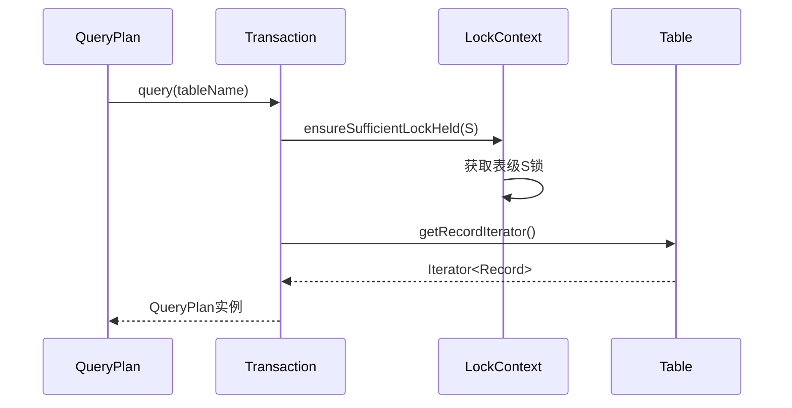

# SQL优化和执行层 - 面试准备方案

## 你的理解回顾
- Project3实现: SNLJ、SHJ、GHJ、SMJ、外部排序、外部哈希等算子
- 基于成本、左深连接树、索引下推的动态规划查询优化器
- 火山模型/迭代器模型执行
- 底层表访问通过事务接口获取（需要理解这个设计）

## 核心代码位置
```
/query/
  ├── QueryPlan.java          - 查询优化器入口
  ├── QueryOperator.java      - 算子基类
  ├── SequentialScanOperator.java - 顺序扫描
  ├── IndexScanOperator.java  - 索引扫描
  ├── SelectOperator.java     - 选择算子
  ├── ProjectOperator.java    - 投影算子
  ├── SortOperator.java       - 排序算子
  ├── GroupByOperator.java    - 分组算子
  └── join/
      ├── BNLJOperator.java   - 块嵌套循环连接
      ├── SortMergeOperator.java - 排序合并连接
      └── GHJOperator.java    - Grace哈希连接
```

## 查询优化三阶段



## 动态规划优化器详解

### 核心思想
```
最优(A ⋈ B ⋈ C) = min{
    最优(A ⋈ B) ⋈ C,
    最优(A ⋈ C) ⋈ B,
    最优(B ⋈ C) ⋈ A
}
```

### 实现代码逻辑
```java
// QueryPlan.java 简化版
public QueryOperator execute() {
    // 第一阶段: 单表最优访问
    Map<Set<String>, QueryOperator> pass1 = new HashMap<>();
    for (String table : tables) {
        QueryOperator bestAccess = minCostSingleAccess(table);
        pass1.put(Set.of(table), bestAccess);
    }
    
    // 第二阶段: 动态规划连接
    Map<Set<String>, QueryOperator> prevPass = pass1;
    for (int i = 2; i <= tables.size(); i++) {
        Map<Set<String>, QueryOperator> currPass = new HashMap<>();
        for (Set<String> subset : subsetsOfSize(tables, i)) {
            QueryOperator best = null;
            for (String table : subset) {
                Set<String> rest = subset.minus(table);
                QueryOperator left = prevPass.get(rest);
                QueryOperator right = pass1.get(Set.of(table));
                QueryOperator joined = minCostJoin(left, right);
                if (best == null || joined.cost() < best.cost()) {
                    best = joined;
                }
            }
            currPass.put(subset, best);
        }
        prevPass = currPass;
    }
    
    // 第三阶段: 添加其他算子
    QueryOperator result = prevPass.get(allTables);
    result = addGroupBy(result);
    result = addProject(result);
    result = addOrderBy(result);
    result = addLimit(result);
    return result;
}
```

## 连接算法对比

| 算法 | 适用场景 | I/O复杂度 | 内存需求 |
|------|----------|-----------|----------|
| SNLJ | 小表 | O(M×N) | O(1) |
| BNLJ | 通用 | O(M×N/B) | O(B) |
| SortMerge | 已排序/范围连接 | O(M+N) | O(√M) |
| GraceHash | 等值连接大表 | O(3(M+N)) | O(√M) |

### BNLJ实现要点
```java
// 外层按块读取
for (Page outerBlock : outerRelation.getPages(B-2)) {
    // 内层完整扫描
    for (Record innerRecord : innerRelation) {
        for (Record outerRecord : outerBlock) {
            if (joinCondition(outerRecord, innerRecord)) {
                emit(outerRecord, innerRecord);
            }
        }
    }
}
```

### GraceHash两阶段
```java
// 第一阶段: 分区
for (Record r : leftRelation) {
    int partition = hash(r.joinKey) % numPartitions;
    partitions[partition].add(r);
}
// 第二阶段: 连接
for (int i = 0; i < numPartitions; i++) {
    HashTable ht = buildHashTable(leftPartition[i]);
    for (Record r : rightPartition[i]) {
        for (Record match : ht.probe(r.joinKey)) {
            emit(match, r);
        }
    }
}
```

## 火山模型/迭代器模型



### 优点
1. **惰性求值**: 只在需要时计算
2. **内存高效**: 不需要物化中间结果
3. **流水线**: 数据可以直接从一个算子流向下一个
4. **统一接口**: 所有算子实现相同的Iterator接口

### 实现
```java
public abstract class QueryOperator implements Iterator<Record> {
    public abstract boolean hasNext();
    public abstract Record next();
    
    // 子类实现具体逻辑
}
```

## 为什么通过事务接口访问表？



**设计目的**:
1. **事务语义封装**: 所有表访问都在事务上下文中
2. **自动加锁**: Transaction内部自动获取必要的锁
3. **日志记录**: 修改操作自动记录WAL
4. **隔离性保证**: 遵循2PL协议

## 面试问答准备

### Q1: 你的查询优化器是怎么工作的？
**A**: 我实现了基于System R的三阶段动态规划优化器：
1. **单表访问优化**: 对每个表选择最优访问路径（索引扫描或顺序扫描）
2. **连接顺序优化**: 使用动态规划枚举所有左深连接树，计算成本选择最优
3. **其他算子添加**: 按顺序添加GroupBy、Project、OrderBy、Limit

### Q2: 动态规划优化有什么优势？
**A**: 
- 保证找到最优的连接顺序
- 时间复杂度O(n!)降低到O(n×2^n)
- 可以复用子问题的最优解
- 支持剪枝优化

### Q3: 你实现了哪些连接算法？各自的优缺点？
**A**: 
- **BNLJ**: 通用，实现简单，但I/O次数多
- **SortMerge**: 适合已排序数据和范围连接，输出有序
- **GraceHash**: 适合大表等值连接，但需要额外分区I/O

### Q4: 什么是火山模型？
**A**: 火山模型是一种查询执行模型，每个算子实现Iterator接口（next/hasNext），执行时从顶层算子开始逐层拉取数据。优点是惰性求值、内存高效、支持流水线执行。

### Q5: 为什么选择左深连接树？
**A**: 
- 左深树支持流水线执行，不需要物化右子树
- 搜索空间更小，优化更快
- 对于大多数OLTP查询足够好

## 深入理解要点

1. **成本估算依据什么？**
   - 表的行数、页数
   - 索引选择性
   - I/O成本模型

2. **索引下推是什么？**
   - 将选择谓词下推到扫描算子
   - 如果有合适索引，使用索引扫描代替顺序扫描

3. **外部排序/哈希的作用？**
   - 当数据量超过内存时，使用磁盘辅助
   - 分阶段处理：划分小块 → 内存处理 → 归并
