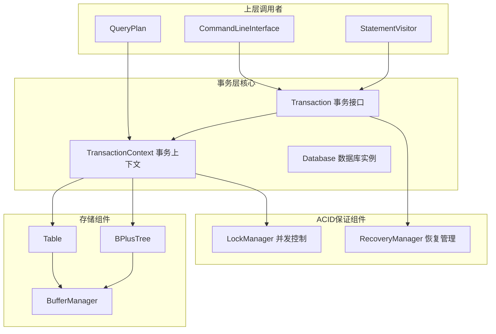
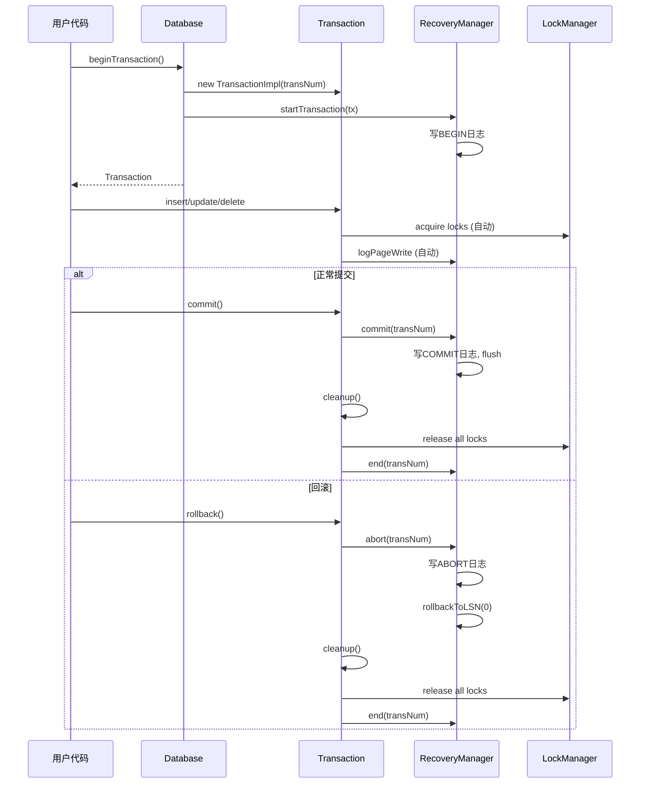
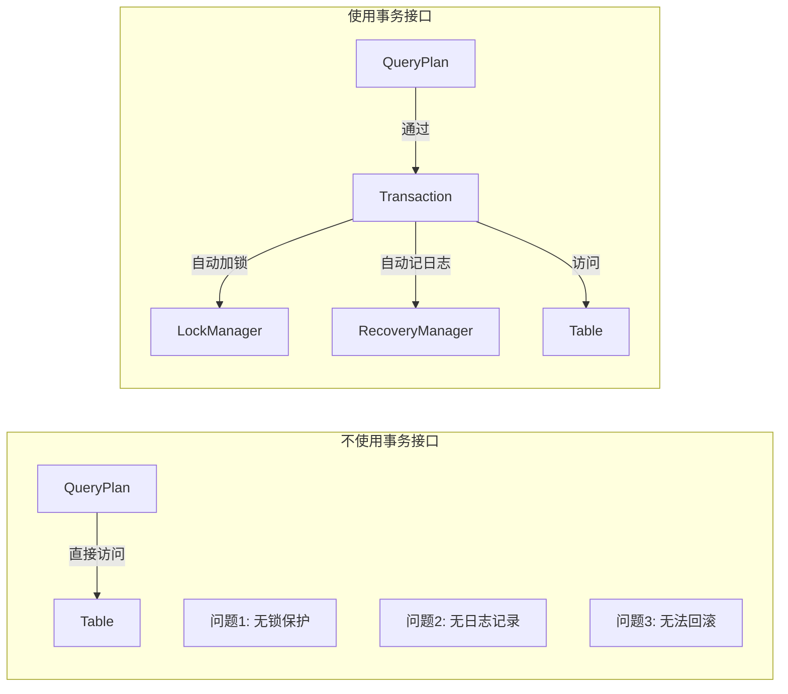

# 事务层 - 面试准备方案

## 为什么事务层是核心？

事务层是整个存储引擎的**中心枢纽**：
- 向上：为SQL执行层提供统一的数据访问接口
- 向下：协调并发控制(LockManager)和恢复机制(RecoveryManager)
- 封装ACID特性的实现



## 核心代码位置
```
/Database.java
  ├── Database          - 数据库主类，管理所有资源
  ├── TransactionImpl   - Transaction的内部实现类
  └── TransactionContextImpl - TransactionContext的内部实现类

/Transaction.java       - 事务公共接口（用户使用）
/TransactionContext.java - 事务内部接口（内部组件使用）
```

## 三个核心类的职责

### 1. Database - 资源管理器
```java
public class Database {
    // 核心组件
    private final LockManager lockManager;        // 锁管理器
    private final DiskSpaceManager diskSpaceManager; // 磁盘管理器
    private final BufferManager bufferManager;     // 缓冲管理器
    private final RecoveryManager recoveryManager; // 恢复管理器
    
    // 事务管理
    private long numTransactions;                  // 事务计数器
    private Phaser activeTransactions;             // 活跃事务追踪
    
    // 创建事务
    public synchronized Transaction beginTransaction() {
        TransactionImpl t = new TransactionImpl(numTransactions, false);
        recoveryManager.startTransaction(t);  // 通知恢复管理器
        ++numTransactions;
        TransactionContext.setTransaction(t.getTransactionContext());
        return t;
    }
}
```

### 2. Transaction - 用户接口
```java
public abstract class Transaction {
    // 事务状态
    enum Status { RUNNING, COMMITTING, ABORTING, COMPLETE, RECOVERY_ABORTING }
    
    // 生命周期
    public final void commit();     // 提交
    public final void rollback();   // 回滚
    public abstract void cleanup(); // 清理资源
    
    // DDL操作
    public abstract void createTable(Schema s, String tableName);
    public abstract void dropTable(String tableName);
    public abstract void createIndex(String tableName, String columnName, boolean bulkLoad);
    
    // DML操作
    public abstract QueryPlan query(String tableName);
    public abstract void insert(String tableName, Record record);
    public abstract void update(...);
    public abstract void delete(...);
    
    // 保存点
    public abstract void savepoint(String name);
    public abstract void rollbackToSavepoint(String name);
}
```

### 3. TransactionContext - 内部接口
```java
public abstract class TransactionContext {
    // 线程绑定的当前事务
    static Map<Long, TransactionContext> threadTransactions;
    
    public static TransactionContext getTransaction();  // 获取当前线程事务
    public static void setTransaction(TransactionContext tx);
    public static void unsetTransaction();
    
    // 底层操作（供内部组件使用）
    public abstract RecordId addRecord(String tableName, Record record);
    public abstract RecordId deleteRecord(String tableName, RecordId rid);
    public abstract Record getRecord(String tableName, RecordId rid);
    public abstract BacktrackingIterator<Record> getRecordIterator(String tableName);
    
    // 阻塞/唤醒（用于锁等待）
    public void prepareBlock();
    public void block();
    public void unblock();
}
```

## 事务生命周期



## TransactionImpl 关键实现

```java
private class TransactionImpl extends Transaction {
    private long transNum;
    private TransactionContext transactionContext;
    
    @Override
    protected void startCommit() {
        // 1. 删除临时表
        transactionContext.deleteAllTempTables();
        // 2. 调用恢复管理器提交
        recoveryManager.commit(transNum);
        // 3. 清理资源
        this.cleanup();
    }
    
    @Override
    protected void startRollback() {
        // 1. 调用恢复管理器中止（会回滚所有修改）
        recoveryManager.abort(transNum);
        // 2. 清理资源
        this.cleanup();
    }
    
    @Override
    public void cleanup() {
        if (getStatus() == Status.COMPLETE) return;
        
        // 1. 通知恢复管理器事务结束
        recoveryManager.end(transNum);
        // 2. 关闭事务上下文（释放锁、清理临时表等）
        transactionContext.close();
        // 3. 从活跃事务中移除
        activeTransactions.arriveAndDeregister();
    }
}
```

## 为什么通过Transaction接口访问表？

这是一个关键的设计决策，回答你之前的疑问：



**通过Transaction接口的好处**：
1. **自动加锁**: 每次表访问自动获取必要的锁
2. **自动日志**: 每次修改自动记录WAL日志
3. **可回滚**: 事务失败时可以撤销所有修改
4. **隔离性**: 保证事务之间相互隔离

## ACID特性如何保证

| 特性 | 实现机制 | 核心组件 |
|------|----------|----------|
| **A**tomicity | WAL + Undo | RecoveryManager |
| **C**onsistency | 约束检查 | Transaction |
| **I**solation | 2PL | LockManager |
| **D**urability | WAL + Force | RecoveryManager + BufferManager |

## 面试问答准备

### Q1: 事务层在系统中起什么作用？
**A**: 事务层是数据库的中心协调者：
1. 为上层提供统一的数据访问接口
2. 封装并发控制和恢复机制
3. 保证ACID特性
4. 管理事务的生命周期

### Q2: Transaction和TransactionContext有什么区别？
**A**: 
- **Transaction**: 面向用户的接口，提供DDL/DML操作
- **TransactionContext**: 面向内部的接口，提供底层记录操作
- Transaction内部持有TransactionContext
- TransactionContext通过ThreadLocal绑定到当前线程

### Q3: 事务是如何提交的？
**A**: 提交流程：
1. 删除临时表
2. 调用RecoveryManager.commit()写入COMMIT日志并flush
3. 调用cleanup()释放所有锁
4. 调用RecoveryManager.end()写入END日志
5. 从活跃事务列表中移除

### Q4: 如何保证事务的原子性？
**A**: 通过WAL和Undo机制：
1. 所有修改先写日志（WAL原则）
2. 事务回滚时通过Undo日志撤销修改
3. 崩溃恢复时撤销未完成事务的所有操作

### Q5: 为什么TransactionContext要绑定到线程？
**A**: 
1. 数据库假设一个线程同时只运行一个事务
2. 内部组件可以通过getTransaction()获取当前事务
3. 不需要显式传递事务参数
4. 简化锁管理和日志记录

## 与商业数据库对比

| 特性 | RookieDB | MySQL InnoDB | PostgreSQL |
|------|----------|--------------|------------|
| 事务接口 | Transaction | Connection | Connection |
| 隔离级别 | 可串行化(2PL) | 多种(MVCC+锁) | 多种(MVCC) |
| 自动提交 | 手动 | 可配置 | 可配置 |
| 保存点 | 支持 | 支持 | 支持 |

## 深入理解要点

1. **为什么需要recoveryTransaction标志？**
   - 恢复事务不需要写日志（它是在读日志）
   - 恢复事务不绑定到线程
   - 区分正常事务和恢复期间创建的事务

2. **activeTransactions.arriveAndDeregister()的作用？**
   - 使用Phaser追踪活跃事务数量
   - 数据库关闭时等待所有事务完成
   - cleanup时移除事务

3. **TransactionContext.close()做了什么？**
   - 释放所有持有的锁（按逆序释放）
   - 删除临时表
   - 解除线程绑定
