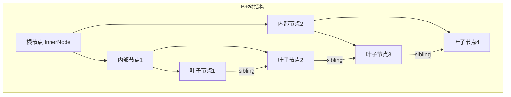
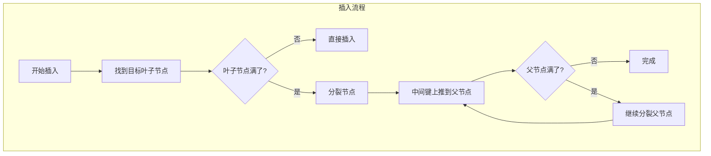
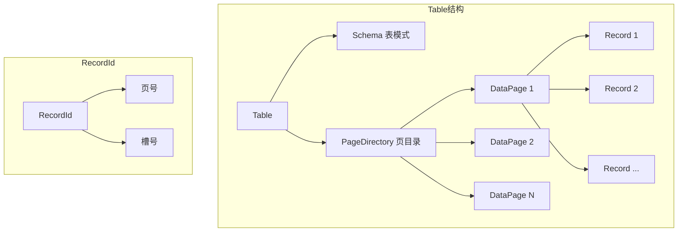
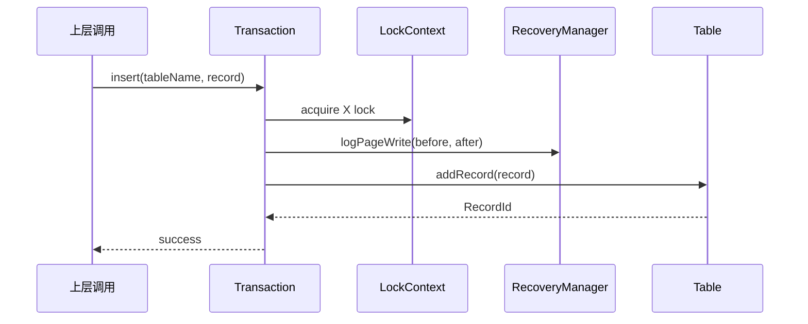

# 索引层和数据表层 - 面试准备方案

## 你的理解回顾
- Project2: B+树实现 (get, put, remove, bulkLoad, scan)
- LeafNode、InnerNode、BPlusTree的核心操作
- /table部分不太熟悉，不理解为什么通过事务接口访问表

## 核心代码位置
```
/index/
  ├── BPlusTree.java      - B+树入口
  ├── BPlusNode.java      - 节点基类
  ├── InnerNode.java      - 内部节点
  ├── LeafNode.java       - 叶子节点
  └── BPlusTreeMetadata.java - 元数据
  
/table/
  ├── Table.java          - 表管理
  ├── PageDirectory.java  - 页目录
  ├── Record.java         - 记录
  ├── RecordId.java       - 记录ID
  └── Schema.java         - 表模式
```

## B+树结构



### B+树 vs B树

| 特性 | B+树 | B树 |
|------|------|-----|
| 数据位置 | 只在叶子节点 | 所有节点 |
| 叶子链表 | 有(支持范围查询) | 无 |
| 扇出度 | 更大(内部节点不存数据) | 较小 |
| 范围查询 | O(logN + M) | O(logN × M) |
| 磁盘局部性 | 更好 | 较差 |

## 核心操作实现

### 1. get(key) - 点查询
```java
public RecordId get(DataBox key) {
    // 从根节点开始向下搜索
    LeafNode leaf = root.getLeftmostLeaf();
    // 找到包含key的叶子节点
    while (leaf != null) {
        Optional<RecordId> rid = leaf.getKey(key);
        if (rid.isPresent()) return rid.get();
        // 沿着叶子链表继续
        leaf = leaf.getRightSibling();
    }
    return null;
}
```

### 2. put(key, rid) - 插入


```java
public void put(DataBox key, RecordId rid) {
    // 1. 找到目标叶子节点
    LeafNode leaf = findLeaf(key);
    
    // 2. 插入键值对
    Optional<Pair<DataBox, Long>> overflow = leaf.put(key, rid);
    
    // 3. 如果分裂，处理溢出
    if (overflow.isPresent()) {
        // 向上传播分裂
        propagateSplit(overflow.get());
    }
}
```

### 3. remove(key) - 删除
```java
public void remove(DataBox key) {
    LeafNode leaf = findLeaf(key);
    leaf.remove(key);
    // 简化实现：不处理下溢合并
}
```

### 4. bulkLoad - 批量加载
```java
public void bulkLoad(Iterator<Pair<DataBox, RecordId>> data) {
    // 排序数据
    List<Pair<DataBox, RecordId>> sorted = sort(data);
    
    // 自底向上构建
    // 1. 填满叶子节点（填充因子控制）
    // 2. 构建内部节点
    // 优势：减少分裂，更紧凑的结构
}
```

### 5. scanAll / scanGreaterEqual - 范围扫描
```java
public Iterator<RecordId> scanGreaterEqual(DataBox key) {
    LeafNode leaf = findLeaf(key);
    return new BPlusTreeIterator(leaf, key);
}

// 利用叶子节点链表顺序遍历
class BPlusTreeIterator {
    public RecordId next() {
        RecordId rid = currentLeaf.getNext();
        if (currentLeaf.exhausted()) {
            currentLeaf = currentLeaf.getRightSibling();
        }
        return rid;
    }
}
```

## 表结构设计



### PageDirectory的作用
- 跟踪哪些页有空闲空间
- 分配新页面
- 管理页面的记录

### 为什么通过Transaction访问表？



**设计目的**:
1. **并发控制**: 自动获取必要的锁
2. **WAL日志**: 自动记录修改操作
3. **事务边界**: 确保操作在事务上下文中
4. **抽象隔离**: 上层不需要关心底层实现细节

## 面试问答准备

### Q1: 为什么数据库选择B+树而不是B树？
**A**: B+树更适合数据库场景：
1. 所有数据在叶子节点，支持高效范围查询
2. 叶子节点有链表连接，顺序访问更快
3. 内部节点不存数据，扇出度更大，树更矮
4. 更好的磁盘局部性，减少I/O

### Q2: B+树插入时如何处理节点分裂？
**A**: 
1. 找到目标叶子节点
2. 如果叶子节点已满，分裂成两个节点
3. 中间键提升到父节点
4. 如果父节点也满了，继续向上分裂
5. 可能导致树高度增加

### Q3: 批量加载有什么优势？
**A**: 
1. 数据预排序，减少分裂操作
2. 可以控制填充因子，预留空间
3. 自底向上构建，更高效
4. 结构更紧凑，查询更快

### Q4: 你是怎么实现范围查询的？
**A**: 利用B+树叶子节点的链表结构：
1. 首先通过树查找找到起始叶子节点
2. 然后沿着叶子链表顺序遍历
3. 直到超出查询范围或遍历完成

### Q5: RecordId的设计？
**A**: RecordId = (pageNum, entryNum)
- pageNum: 记录所在的页号
- entryNum: 记录在页内的槽号
- 通过这两个值可以唯一定位一条记录

## 深入理解要点

1. **LeafNode vs InnerNode的区别？**
   - LeafNode: 存储(key, RecordId)对，有右兄弟指针
   - InnerNode: 存储(key, childPageNum)对，用于路由

2. **fromBytes的作用？**
   - 从磁盘页面反序列化节点
   - 解析页面字节数据重建节点结构

3. **getLeftmostLeaf的用途？**
   - 用于全表扫描的起点
   - 从根节点一直向左下走到最左叶子

4. **Table和Index的关系？**
   - Table存储实际数据记录
   - Index存储(key → RecordId)的映射
   - 通过RecordId可以快速定位Table中的记录
