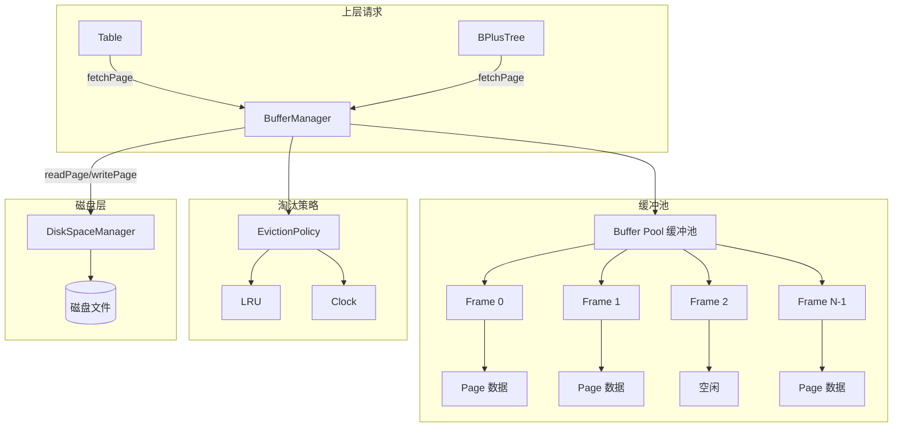
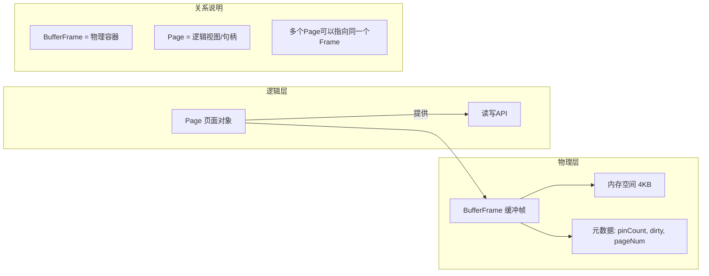
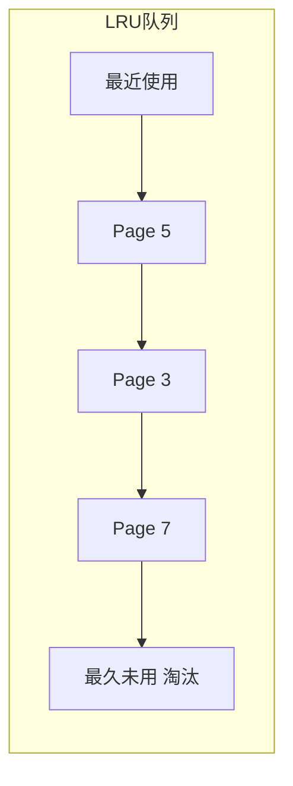
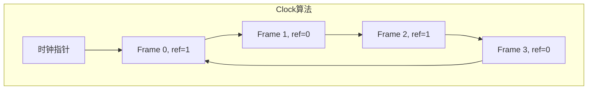
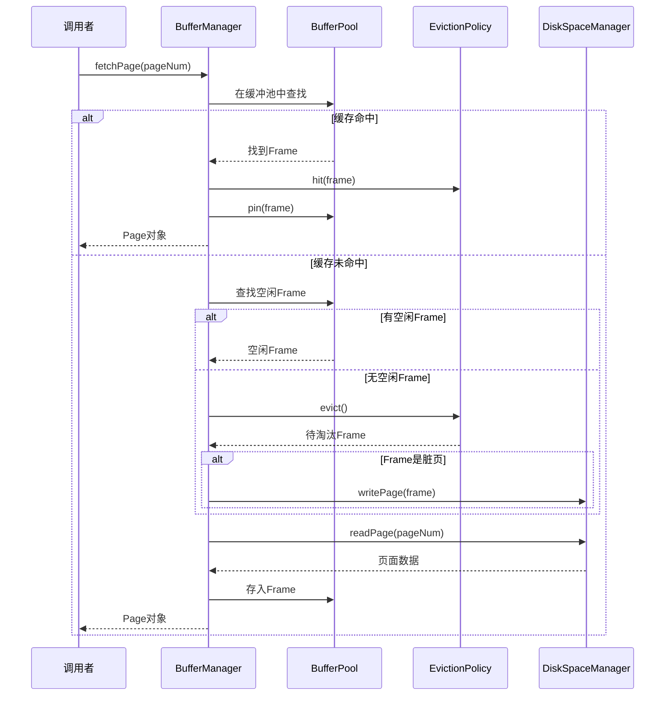

# 缓冲管理器 - 面试准备方案

## 你的理解回顾
- /memory 中的内容
- 实现了可插拔的内存页面淘汰算法
- 不太理解 BufferFrame 和 Page 的关系
- 类似操作系统的虚拟内存机制

## 核心代码位置
```
/memory/
  ├── BufferManager.java    - 缓冲池管理器
  ├── BufferFrame.java      - 缓冲帧（物理容器）
  ├── Page.java             - 页面（逻辑视图）
  ├── EvictionPolicy.java   - 淘汰策略接口
  ├── LRUEvictionPolicy.java - LRU策略
  └── ClockEvictionPolicy.java - Clock策略

/common/
  ├── Buffer.java           - 缓冲区接口
  ├── ByteBuffer.java       - 字节缓冲区
  └── AbstractBuffer.java   - 抽象缓冲区
```

## 缓冲池架构



## BufferFrame vs Page 的关系



**核心区别**:
- **BufferFrame**: 缓冲池中的物理槽位，管理内存和元数据
- **Page**: 用户层面的页面句柄，提供读写接口

```java
// BufferFrame - 管理物理资源
class BufferFrame {
    byte[] contents;     // 实际的页面数据
    int pinCount;        // 引用计数
    boolean dirty;       // 是否被修改
    long pageNum;        // 对应的页号
}

// Page - 逻辑接口
class Page {
    BufferFrame frame;   // 指向的缓冲帧
    
    public void get(byte[] buf) { /* 读取数据 */ }
    public void put(byte[] buf) { /* 写入数据 */ }
    public void unpin() { /* 减少引用计数 */ }
}
```

## 页面淘汰策略

### LRU (Least Recently Used)


```java
class LRUEvictionPolicy {
    LinkedList<BufferFrame> queue;
    
    void hit(BufferFrame frame) {
        queue.remove(frame);
        queue.addFirst(frame);  // 移到队首
    }
    
    BufferFrame evict() {
        return queue.removeLast();  // 淘汰队尾
    }
}
```

### Clock (时钟算法)


```java
class ClockEvictionPolicy {
    int clockHand = 0;
    
    BufferFrame evict() {
        while (true) {
            BufferFrame frame = frames[clockHand];
            if (frame.referenced) {
                frame.referenced = false;  // 给第二次机会
            } else {
                return frame;  // 淘汰
            }
            clockHand = (clockHand + 1) % numFrames;
        }
    }
}
```

### LRU vs Clock 对比

| 特性 | LRU | Clock |
|------|-----|-------|
| 精确度 | 精确 | 近似 |
| 实现复杂度 | 较高 | 简单 |
| 时间复杂度 | O(1) 需要额外数据结构 | O(1) 均摊 |
| 空间开销 | 需要链表 | 只需要引用位 |
| 适用场景 | 读密集 | 写密集 |

## 缓冲管理核心流程

### fetchPage 获取页面


## 与操作系统虚拟内存的类比

| 概念 | 操作系统 | 数据库缓冲池 |
|------|----------|--------------|
| 物理容器 | 物理页框 | BufferFrame |
| 逻辑视图 | 虚拟页 | Page |
| 地址映射 | 页表 | PageNum → Frame映射 |
| 缺页处理 | 缺页中断 | 缓存未命中 |
| 淘汰策略 | LRU/Clock | LRU/Clock |
| 写回策略 | 写时复制 | 脏页写回 |

## 面试问答准备

### Q1: 缓冲池的作用是什么？
**A**: 缓冲池是数据库和磁盘之间的缓存层：
1. 减少磁盘I/O，提高性能
2. 管理页面的生命周期
3. 处理脏页写回
4. 实现页面淘汰策略

### Q2: LRU和Clock算法的区别？
**A**: 
- **LRU**: 精确追踪访问顺序，淘汰最久未使用的页面
- **Clock**: 使用引用位近似LRU，实现更简单
- LRU适合读密集场景，Clock适合写密集场景

### Q3: 什么是脏页？怎么处理？
**A**: 脏页是被修改但还未写回磁盘的页面：
1. 修改页面时标记dirty=true
2. 淘汰脏页前必须先写回磁盘
3. 检查点时会批量写回脏页
4. WAL保证即使脏页丢失也能恢复

### Q4: Pin/Unpin是做什么的？
**A**: 
- **Pin**: 增加页面引用计数，防止被淘汰
- **Unpin**: 减少引用计数，pinCount=0时可被淘汰
- 类似于智能指针的引用计数机制

### Q5: BufferFrame和Page的区别？
**A**: 
- **BufferFrame**: 缓冲池中的物理槽位，包含实际内存和元数据
- **Page**: 逻辑句柄，提供读写接口
- 一个Frame可以有多个Page引用，但实际数据只有一份

## 深入理解要点

1. **为什么需要引用计数？**
   - 防止正在使用的页面被淘汰
   - 类似操作系统的页面锁定

2. **写回策略是什么？**
   - RookieDB使用写回(write-back)而非写穿(write-through)
   - 修改先写到缓冲区，延迟写回磁盘
   - 需要WAL保证持久性

3. **缓冲池大小如何影响性能？**
   - 太小：缓存命中率低，I/O多
   - 太大：内存浪费，可能影响其他操作
   - 需要根据工作负载调优
