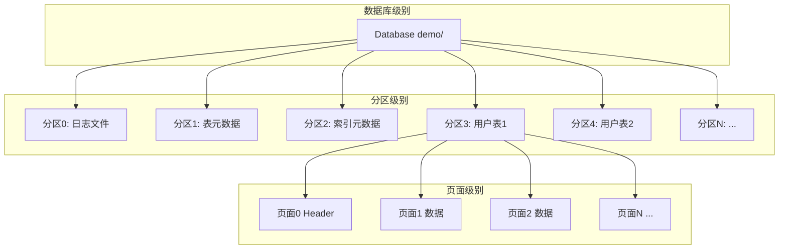
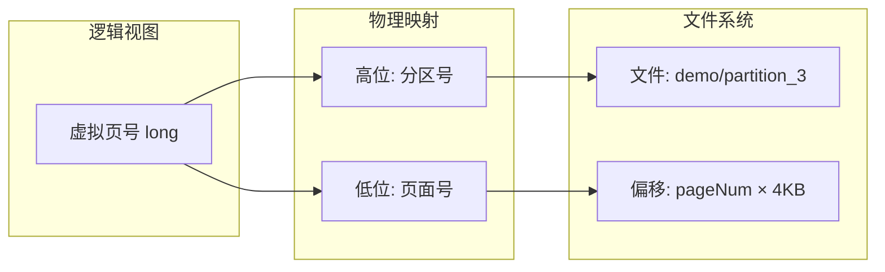
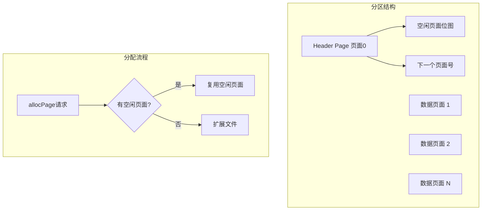
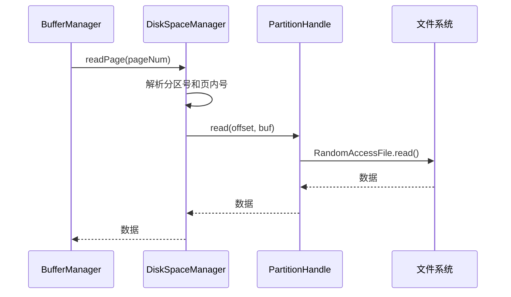

# 磁盘管理器 - 面试准备方案

## 你的理解回顾
- 直接与操作系统文件系统打交道
- 数据库 = 文件夹，分区 = 文件
- 提供分配/释放分区和页面的方法

## 核心代码位置
```
/io/
  ├── DiskSpaceManager.java     - 接口定义
  ├── DiskSpaceManagerImpl.java - 实现
  └── PartitionHandle.java      - 分区句柄
```

## 存储层次结构



## 分区与页面映射



```java
// 虚拟页号编码
// 高32位: 分区号, 低32位: 页内编号
long virtualPageNum = ((long) partNum << 32) | pageNum;

// 解码
int partNum = (int) (virtualPageNum >> 32);
int pageNum = (int) virtualPageNum;
```

## 核心API

### DiskSpaceManager接口
```java
public interface DiskSpaceManager {
    // 分区管理
    int allocPart();                    // 分配新分区
    int allocPart(int partNum);         // 分配指定分区
    void freePart(int partNum);         // 释放分区
    
    // 页面管理
    long allocPage(int partNum);        // 在分区中分配页面
    long allocPage(long pageNum);       // 分配指定页面
    void freePage(long pageNum);        // 释放页面
    
    // 读写操作
    void readPage(long pageNum, byte[] buf);   // 读取页面
    void writePage(long pageNum, byte[] buf);  // 写入页面
}
```

### 实现要点

```java
public class DiskSpaceManagerImpl implements DiskSpaceManager {
    private String dbDir;                    // 数据库目录
    private Map<Integer, PartitionHandle> partitions;  // 分区句柄
    
    // 分配分区 = 创建新文件
    public int allocPart() {
        int partNum = nextPartNum++;
        File file = new File(dbDir, "partition_" + partNum);
        partitions.put(partNum, new PartitionHandle(file));
        return partNum;
    }
    
    // 读取页面 = 文件seek + read
    public void readPage(long pageNum, byte[] buf) {
        int partNum = getPartNum(pageNum);
        int pageOffset = getPageNum(pageNum);
        PartitionHandle handle = partitions.get(partNum);
        handle.seek(pageOffset * PAGE_SIZE);
        handle.read(buf);
    }
    
    // 写入页面 = 文件seek + write
    public void writePage(long pageNum, byte[] buf) {
        int partNum = getPartNum(pageNum);
        int pageOffset = getPageNum(pageNum);
        PartitionHandle handle = partitions.get(partNum);
        handle.seek(pageOffset * PAGE_SIZE);
        handle.write(buf);
        // 通知恢复管理器
        recoveryManager.diskIOHook(pageNum);
    }
}
```

## 页面分配策略



## 与上层的交互



## 分区用途说明

| 分区号 | 用途 | 说明 |
|--------|------|------|
| 0 | 日志分区 | WAL日志记录 |
| 1 | _metadata.tables | 表元数据 |
| 2 | _metadata.indices | 索引元数据 |
| 3+ | 用户表/索引 | 每个表一个分区 |

## 面试问答准备

### Q1: 磁盘管理器的职责是什么？
**A**: 磁盘管理器是数据库与文件系统之间的抽象层：
1. 管理分区（文件）的分配和释放
2. 管理页面的分配和释放
3. 提供页面级的读写接口
4. 将逻辑页号映射到物理位置

### Q2: 为什么需要分区的概念？
**A**: 
1. **隔离性**: 不同表的数据物理隔离
2. **管理便捷**: 删除表只需删除对应分区文件
3. **并发友好**: 不同分区可以并行I/O
4. **空间管理**: 每个分区独立管理空闲空间

### Q3: 页面大小为什么是4KB？
**A**: 
1. 与操作系统页面大小对齐，减少I/O开销
2. 与磁盘扇区大小（通常512B或4KB）兼容
3. 平衡I/O效率和内存利用率
4. 业界标准，MySQL InnoDB也是16KB

### Q4: 如何保证写入的原子性？
**A**: 
1. 单页面写入依赖WAL保证
2. 先写日志，后写数据页
3. 如果写入中途崩溃，恢复时通过日志重做
4. 某些系统还使用双写缓冲区(doublewrite buffer)

### Q5: 虚拟页号是怎么设计的？
**A**: 使用64位long表示：
- 高32位: 分区号（支持40亿个分区）
- 低32位: 页内编号（每分区40亿个页面）
- 这样设计方便页号的编码解码

## 与商业数据库对比

| 特性 | RookieDB | MySQL InnoDB | PostgreSQL |
|------|----------|--------------|------------|
| 存储单位 | 分区/文件 | 表空间 | 表空间 |
| 页面大小 | 4KB | 16KB | 8KB |
| 页面分配 | 简单位图 | 段(Segment)管理 | FSM |
| 日志分离 | 是 | 是(redo log) | 是(WAL) |

## 深入理解要点

1. **为什么日志是分区0？**
   - 日志是最先需要的，固定分区号便于定位
   - 恢复时首先读取日志分区

2. **PartitionHandle的作用？**
   - 封装RandomAccessFile操作
   - 管理单个分区文件的读写
   - 可以添加缓冲、统计等功能

3. **空闲空间管理？**
   - 使用位图跟踪空闲页面
   - 分配时查找第一个空闲位
   - 释放时置位
