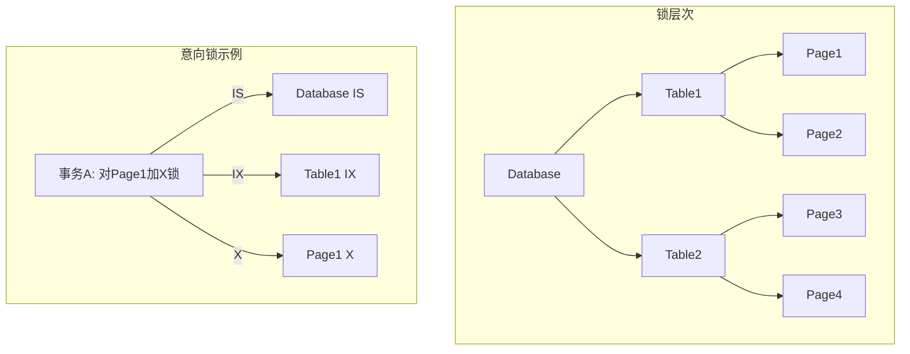
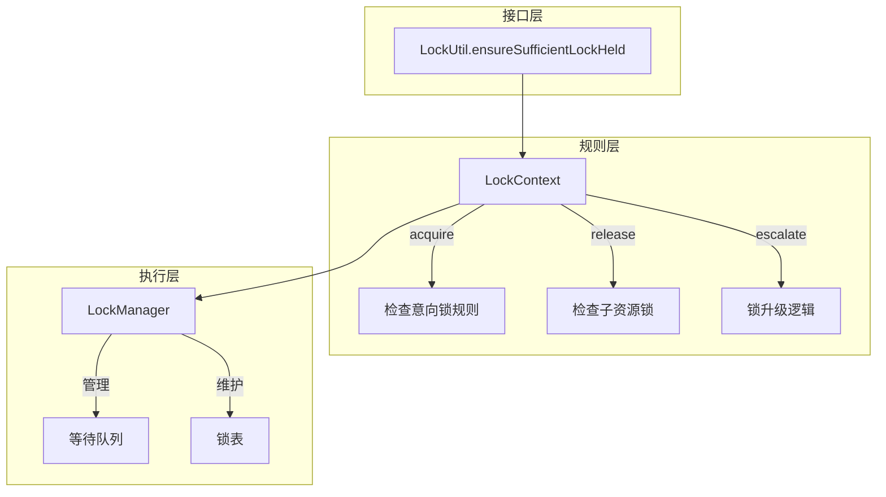
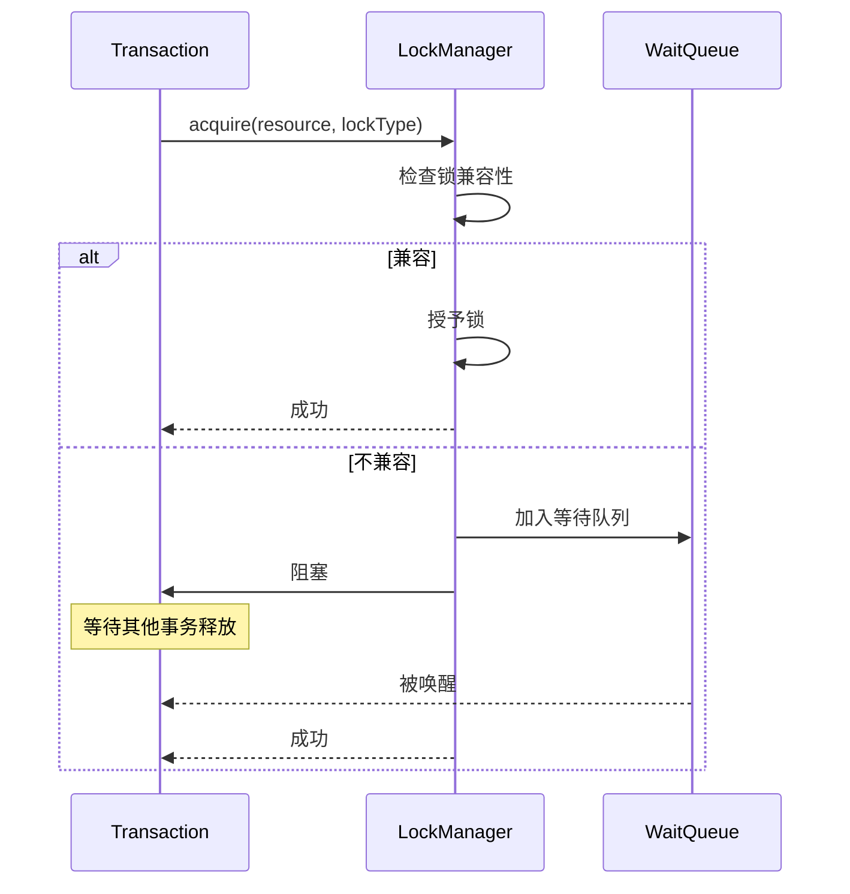
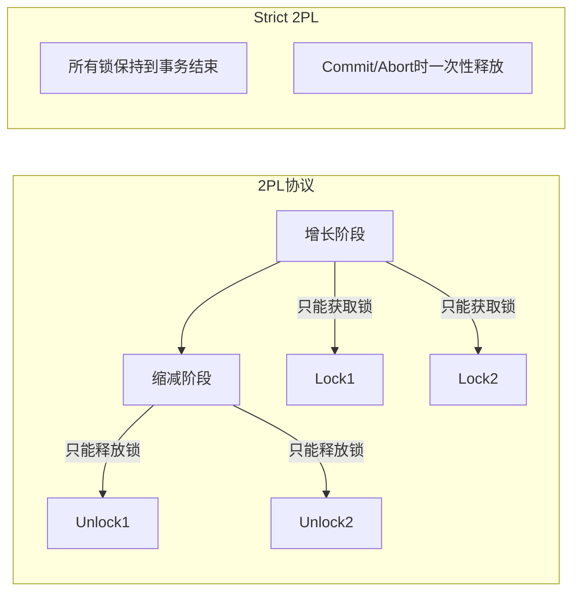

# 并发控制层 - 面试准备方案

## 你的理解回顾
- Project4: 实现基于严格两阶段锁协议的多粒度锁
- LockType: compatible, canBeParentLock, substitutable
- LockManager: 锁执行层，实现等待队列
- LockContext: 多粒度锁规则层
- LockUtil: 对外接口，ensureSufficientLockHeld
- 最低粒度是页面粒度

## 核心代码位置
```
/concurrency/
  ├── LockType.java       - 锁类型定义
  ├── LockManager.java    - 锁管理器（执行层）
  ├── LockContext.java    - 锁上下文（规则层）
  ├── LockUtil.java       - 工具类（接口层）
  ├── Lock.java           - 锁对象
  ├── LockRequest.java    - 锁请求
  └── ResourceName.java   - 资源名称
```

## 多粒度锁层次结构



## 锁类型详解

### 五种锁类型
```
S   - 共享锁 (Shared)
X   - 排他锁 (Exclusive)
IS  - 意向共享锁 (Intent Shared)
IX  - 意向排他锁 (Intent Exclusive)
SIX - 共享意向排他锁 (Shared + Intent Exclusive)
```

### 锁兼容性矩阵
```
     | NL   | IS   | IX   | S    | SIX  | X    |
-----|------|------|------|------|------|------|
NL   | ✓    | ✓    | ✓    | ✓    | ✓    | ✓    |
IS   | ✓    | ✓    | ✓    | ✓    | ✓    | ✗    |
IX   | ✓    | ✓    | ✓    | ✗    | ✗    | ✗    |
S    | ✓    | ✓    | ✗    | ✓    | ✗    | ✗    |
SIX  | ✓    | ✓    | ✗    | ✗    | ✗    | ✗    |
X    | ✓    | ✗    | ✗    | ✗    | ✗    | ✗    |
```

```java
// LockType.java
public static boolean compatible(LockType a, LockType b) {
    // 根据兼容性矩阵判断
    return compatibilityMatrix[a.ordinal()][b.ordinal()];
}
```

### 父锁规则
```java
// canBeParentLock: 判断父资源上的锁是否允许子资源上特定锁
// 规则: 要在子资源上加S/IS锁，父资源必须有IS或更强的锁
//       要在子资源上加X/IX/SIX锁，父资源必须有IX或更强的锁

public static boolean canBeParentLock(LockType parent, LockType child) {
    if (child == S || child == IS) {
        return parent == IS || parent == IX || parent == SIX;
    }
    if (child == X || child == IX || child == SIX) {
        return parent == IX || parent == SIX;
    }
    return true;
}
```

### 锁替代规则
```java
// substitutable: 如果已持有substitute锁，是否满足required锁的需求
// 例如: 持有X锁可以替代S锁需求

public static boolean substitutable(LockType substitute, LockType required) {
    // X 可替代所有锁
    // SIX 可替代 S, IS, IX
    // S 可替代 IS
    // IX 可替代 IS
}
```

## 三层架构设计



## LockManager 实现

### 核心数据结构
```java
public class LockManager {
    // 资源 -> 锁列表
    Map<ResourceName, List<Lock>> resourceLocks;
    // 资源 -> 等待队列
    Map<ResourceName, Queue<LockRequest>> waitingQueue;
    // 事务 -> 持有的锁
    Map<Long, List<Lock>> transactionLocks;
}
```

### acquire 流程


### acquireAndRelease 原子操作
```java
// 原子地获取新锁并释放旧锁，用于锁升级
public void acquireAndRelease(
    TransactionContext txn,
    ResourceName name,
    LockType lockType,
    List<ResourceName> toRelease
) {
    synchronized (this) {
        // 1. 检查是否可以立即授予
        // 2. 如果可以，释放toRelease中的锁
        // 3. 授予新锁
        // 4. 如果不行，加入等待队列
    }
}
```

## LockContext 实现

### 多粒度锁规则
```java
public class LockContext {
    LockContext parent;
    Map<String, LockContext> children;
    ResourceName name;
    
    public void acquire(LockType lockType) {
        // 1. 检查父资源是否有足够的意向锁
        if (parent != null) {
            LockType parentLock = parent.getEffectiveLockType();
            if (!LockType.canBeParentLock(parentLock, lockType)) {
                throw new InvalidLockException();
            }
        }
        // 2. 调用LockManager获取锁
        lockman.acquire(transaction, name, lockType);
    }
    
    public void release() {
        // 检查是否有子资源持有锁
        for (LockContext child : children.values()) {
            if (child.getExplicitLockType() != NL) {
                throw new InvalidLockException("子资源还有锁");
            }
        }
        lockman.release(transaction, name);
    }
}
```

### escalate 锁升级
```java
// 将子资源的锁升级到当前资源
public void escalate() {
    // 例如: Table上有IS, Page1有S, Page2有S
    // 升级后: Table上有S, Page1和Page2的锁释放
    
    // 1. 收集所有子资源的锁
    List<Lock> childLocks = getChildLocks();
    
    // 2. 确定升级后的锁类型
    LockType newType = determineEscalatedType(childLocks);
    
    // 3. 原子地释放子锁并获取新锁
    lockman.acquireAndRelease(txn, name, newType, childResources);
}
```

## LockUtil 对外接口

```java
public class LockUtil {
    // 确保持有足够的锁
    public static void ensureSufficientLockHeld(
        LockContext lockContext, 
        LockType requestType
    ) {
        // 1. 检查当前锁是否满足需求
        LockType currentLock = lockContext.getEffectiveLockType();
        if (LockType.substitutable(currentLock, requestType)) {
            return;  // 已经足够
        }
        
        // 2. 递归确保祖先有意向锁
        ensureAncestorLocks(lockContext.parent, requestType);
        
        // 3. 获取当前资源的锁
        lockContext.acquire(requestType);
    }
}
```

## 严格两阶段锁协议 (Strict 2PL)



**Strict 2PL保证**:
1. 可串行化（Serializability）
2. 避免级联回滚
3. 避免脏读

## 面试问答准备

### Q1: 什么是两阶段锁协议？
**A**: 2PL将事务分为两个阶段：
1. **增长阶段**: 只能获取锁，不能释放
2. **缩减阶段**: 只能释放锁，不能获取
- **Strict 2PL**: 所有锁保持到事务提交或回滚时才释放

### Q2: 什么是多粒度锁？有什么优势？
**A**: 多粒度锁在不同层次（数据库、表、页面）上加锁：
1. **细粒度**: 减少锁冲突，提高并发度
2. **意向锁**: 快速检查子资源是否有锁
3. **锁升级**: 必要时可以从细粒度升级到粗粒度

### Q3: 锁兼容性是怎么判断的？
**A**: 根据兼容性矩阵判断：
- S与S兼容，S与X冲突
- IS与几乎所有锁兼容（除了X）
- IX与S/X冲突
- SIX只与IS兼容

### Q4: LockManager和LockContext的区别？
**A**: 
- **LockManager**: 执行层，管理锁的获取/释放，维护等待队列
- **LockContext**: 规则层，实现多粒度锁规则，检查意向锁约束

### Q5: 如何处理死锁？
**A**: RookieDB中的处理：
1. 等待图检测（可扩展）
2. 超时机制
3. 事务回滚解除死锁

## 与MySQL对比

| 特性 | RookieDB | MySQL InnoDB |
|------|----------|--------------|
| 锁粒度 | 页面级 | 行级 |
| 协议 | Strict 2PL | 2PL + MVCC |
| 死锁处理 | 简单等待 | 等待图检测 |
| 意向锁 | 支持 | 支持 |
| 锁升级 | 支持 | 支持 |

## 深入理解要点

1. **为什么需要意向锁？**
   - 快速判断子资源是否有锁
   - 避免遍历所有子资源检查

2. **SIX锁的使用场景？**
   - 读取整个表，同时修改部分行
   - 相当于S + IX

3. **锁升级的触发条件？**
   - 子资源锁太多，管理开销大
   - 自动或手动触发escalate
