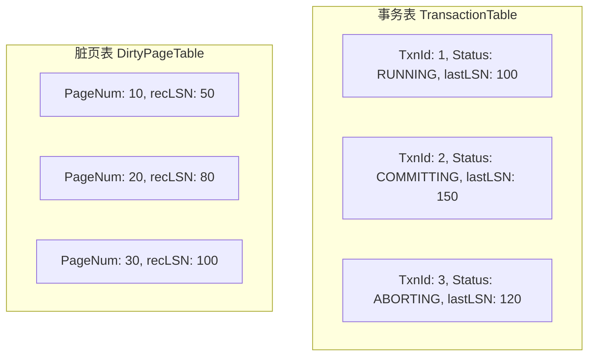
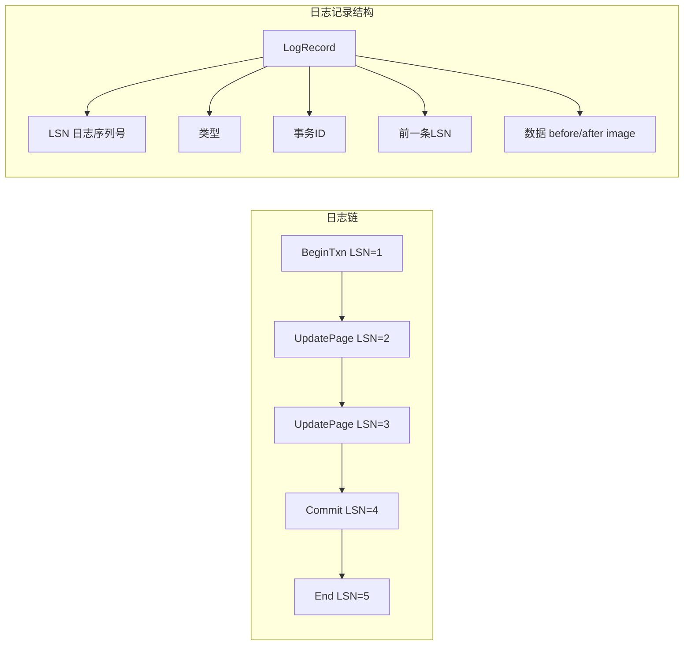
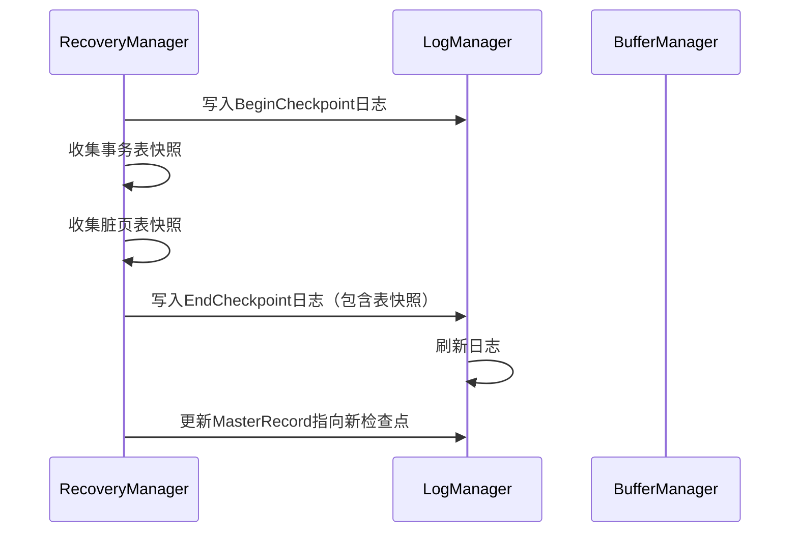
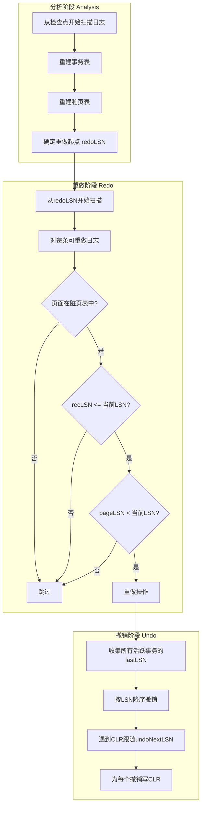

# 恢复管理器 - 面试准备方案

## 你的理解回顾
- Project5: 实现ARIESRecoveryManager
- 正向处理: commit, abort, end, rollbackToLSN, logPageWrite, rollbackToSavePoint, checkPoint
- 重启恢复: restart (分析、重做、撤销三阶段)

## 核心代码位置
```
/recovery/
  ├── ARIESRecoveryManager.java  - ARIES恢复管理器
  ├── RecoveryManager.java       - 接口定义
  ├── LogManager.java            - 日志管理器
  ├── LogRecord.java             - 日志记录基类
  ├── TransactionTableEntry.java - 事务表条目
  └── records/
      ├── MasterLogRecord.java   - 主记录
      ├── BeginTransactionLogRecord.java
      ├── CommitTransactionLogRecord.java
      ├── AbortTransactionLogRecord.java
      ├── EndTransactionLogRecord.java
      ├── UpdatePageLogRecord.java
      ├── UndoUpdatePageLogRecord.java  - CLR
      └── ...
```

## ARIES核心概念

### 三大原则
```
1. Write-Ahead Logging (WAL)
   - 修改数据页之前，必须先写日志
   - 保证原子性和持久性

2. Repeating History During Redo
   - 重启时重做所有操作，恢复到崩溃前状态
   - 包括未提交事务的操作

3. Logging Changes During Undo
   - 撤销时记录CLR（补偿日志记录）
   - 确保撤销过程幂等，可重复执行
```

### 关键数据结构



```java
// 事务表条目
class TransactionTableEntry {
    long transNum;           // 事务号
    Transaction.Status status; // 状态
    long lastLSN;           // 最后一条日志LSN
    Set<Long> touchedPages; // 触及的页面
    List<Long> savepointStack; // 保存点栈
}

// 脏页表
Map<Long, Long> dirtyPageTable;  // pageNum -> recLSN
// recLSN: 第一次使页面变脏的日志LSN
```

## 日志结构



## 正向处理阶段

### commit() 提交事务
```java
public void commit(long transNum) {
    TransactionTableEntry entry = transactionTable.get(transNum);
    
    // 1. 写入Commit日志
    long commitLSN = logManager.appendToLog(
        new CommitTransactionLogRecord(transNum, entry.lastLSN)
    );
    entry.lastLSN = commitLSN;
    
    // 2. 刷新日志到磁盘 (Force)
    logManager.flushToLSN(commitLSN);
    
    // 3. 更新事务状态
    entry.transaction.setStatus(Status.COMMITTING);
}
```

### abort() 中止事务
```java
public void abort(long transNum) {
    TransactionTableEntry entry = transactionTable.get(transNum);
    
    // 1. 写入Abort日志
    long abortLSN = logManager.appendToLog(
        new AbortTransactionLogRecord(transNum, entry.lastLSN)
    );
    entry.lastLSN = abortLSN;
    
    // 2. 回滚事务
    rollbackToLSN(transNum, 0);  // 回滚到开始
    
    // 3. 更新状态
    entry.transaction.setStatus(Status.ABORTING);
}
```

### rollbackToLSN() 回滚到指定LSN
```java
public void rollbackToLSN(long transNum, long targetLSN) {
    TransactionTableEntry entry = transactionTable.get(transNum);
    long currLSN = entry.lastLSN;
    
    while (currLSN > targetLSN) {
        LogRecord record = logManager.fetchLogRecord(currLSN);
        
        if (record.isUndoable()) {
            // 1. 创建CLR并写入日志
            LogRecord clr = record.undo(entry.lastLSN);
            long clrLSN = logManager.appendToLog(clr);
            entry.lastLSN = clrLSN;
            
            // 2. 执行撤销操作
            clr.redo(diskSpaceManager, bufferManager);
        }
        
        // 3. 移动到前一条日志
        currLSN = record.getPrevLSN();
    }
}
```

### logPageWrite() 记录页面修改
```java
public long logPageWrite(long transNum, long pageNum, 
                         short offset, byte[] before, byte[] after) {
    TransactionTableEntry entry = transactionTable.get(transNum);
    
    // 1. 创建UpdatePage日志
    long lsn = logManager.appendToLog(
        new UpdatePageLogRecord(transNum, pageNum, entry.lastLSN,
                               offset, before, after)
    );
    entry.lastLSN = lsn;
    
    // 2. 更新脏页表
    dirtyPageTable.putIfAbsent(pageNum, lsn);
    
    return lsn;
}
```

### checkpoint() 检查点


## 重启恢复阶段

### restart() 三阶段恢复



### 分析阶段 (Analysis)
```java
public void restartAnalysis() {
    // 1. 读取MasterRecord获取检查点位置
    long checkpointLSN = logManager.getMasterRecordLSN();
    
    // 2. 从检查点恢复事务表和脏页表
    LogRecord checkpointRecord = logManager.fetchLogRecord(checkpointLSN);
    transactionTable = checkpointRecord.getTransactionTable();
    dirtyPageTable = checkpointRecord.getDirtyPageTable();
    
    // 3. 从检查点向后扫描日志
    Iterator<LogRecord> iter = logManager.scanFrom(checkpointLSN);
    while (iter.hasNext()) {
        LogRecord record = iter.next();
        // 更新事务表
        // 更新脏页表
        // 处理Commit/Abort/End
    }
}
```

### 重做阶段 (Redo)
```java
public void restartRedo() {
    // 从最小的recLSN开始
    long redoLSN = Collections.min(dirtyPageTable.values());
    
    Iterator<LogRecord> iter = logManager.scanFrom(redoLSN);
    while (iter.hasNext()) {
        LogRecord record = iter.next();
        
        if (!record.isRedoable()) continue;
        
        long pageNum = record.getPageNum();
        // 检查是否需要重做
        if (!dirtyPageTable.containsKey(pageNum)) continue;
        if (dirtyPageTable.get(pageNum) > record.getLSN()) continue;
        if (getPageLSN(pageNum) >= record.getLSN()) continue;
        
        // 执行重做
        record.redo(diskSpaceManager, bufferManager);
    }
}
```

### 撤销阶段 (Undo)
```java
public void restartUndo() {
    // 收集需要撤销的事务
    PriorityQueue<Long> toUndo = new PriorityQueue<>(Collections.reverseOrder());
    for (TransactionTableEntry entry : transactionTable.values()) {
        if (entry.status == RUNNING || entry.status == ABORTING) {
            toUndo.add(entry.lastLSN);
        }
    }
    
    // 按LSN降序撤销
    while (!toUndo.isEmpty()) {
        long currLSN = toUndo.poll();
        LogRecord record = logManager.fetchLogRecord(currLSN);
        
        if (record.isUndoable()) {
            // 写CLR并执行撤销
            LogRecord clr = record.undo(entry.lastLSN);
            logManager.appendToLog(clr);
            clr.redo(diskSpaceManager, bufferManager);
        }
        
        // 确定下一个要撤销的LSN
        long nextLSN = record.getUndoNextLSN();
        if (nextLSN != 0) {
            toUndo.add(nextLSN);
        }
    }
}
```

## 面试问答准备

### Q1: ARIES恢复的三个阶段分别做什么？
**A**: 
1. **分析阶段**: 从检查点开始扫描日志，重建事务表和脏页表，确定需要重做和撤销的操作
2. **重做阶段**: 从最早的脏页开始，重做所有操作恢复到崩溃前状态
3. **撤销阶段**: 对未完成的事务进行回滚，写入CLR

### Q2: 什么是WAL？为什么需要它？
**A**: Write-Ahead Logging，写前日志：
1. 数据页修改前必须先写日志
2. 保证即使崩溃也能恢复
3. 日志先刷盘，数据可以延迟写
4. 是现代数据库的标准技术

### Q3: 什么是CLR？有什么作用？
**A**: Compensation Log Record，补偿日志记录：
1. 撤销操作时产生的日志
2. 保证撤销过程幂等
3. 即使恢复过程中再次崩溃也能正确恢复
4. 包含undoNextLSN指向下一个要撤销的日志

### Q4: 检查点的作用是什么？
**A**: 
1. 减少恢复时间，不需要扫描全部日志
2. 保存事务表和脏页表快照
3. 允许截断旧日志
4. 模糊检查点不阻塞正常操作

### Q5: 如何保证页面修改的原子性？
**A**: 
1. 先写日志（WAL）
2. 日志记录before/after image
3. 崩溃恢复时通过重做/撤销恢复一致状态
4. 单页面写入依赖底层原子性

## 与商业数据库对比

| 特性 | RookieDB | MySQL InnoDB | PostgreSQL |
|------|----------|--------------|------------|
| 恢复算法 | ARIES | ARIES变体 | WAL-based |
| 检查点 | 模糊检查点 | 模糊检查点 | 模糊检查点 |
| 日志类型 | 物理日志 | redo + undo log | WAL |
| CLR支持 | 支持 | 支持 | 不同实现 |

## 深入理解要点

1. **recLSN vs pageLSN的区别？**
   - recLSN: 第一次使页面变脏的LSN，用于判断重做起点
   - pageLSN: 页面最后一次修改的LSN，用于判断是否需要重做

2. **为什么要重做已提交事务？**
   - 提交时只保证日志刷盘
   - 数据页可能还在缓冲区未写回
   - 重做确保数据持久化

3. **undoNextLSN的作用？**
   - CLR中的字段，指向下一个要撤销的日志
   - 跳过已经撤销的操作
   - 确保撤销过程不重复
