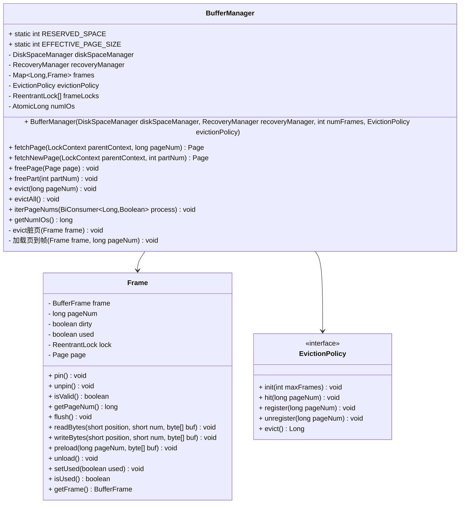
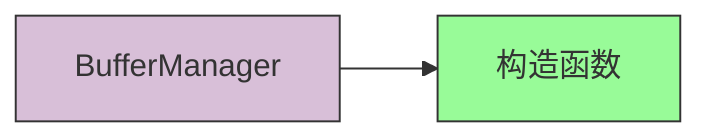
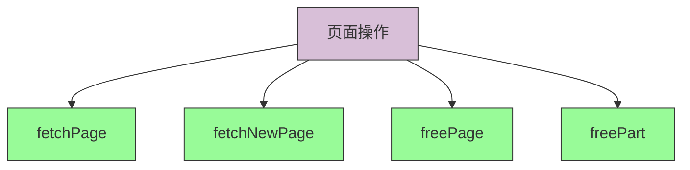
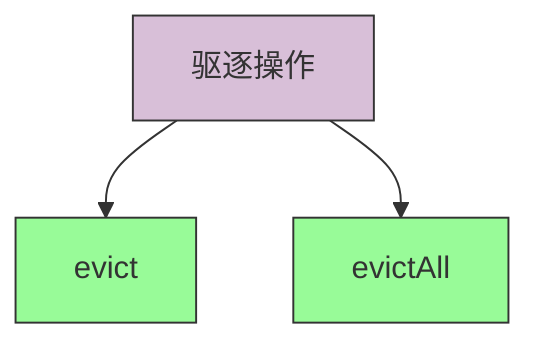
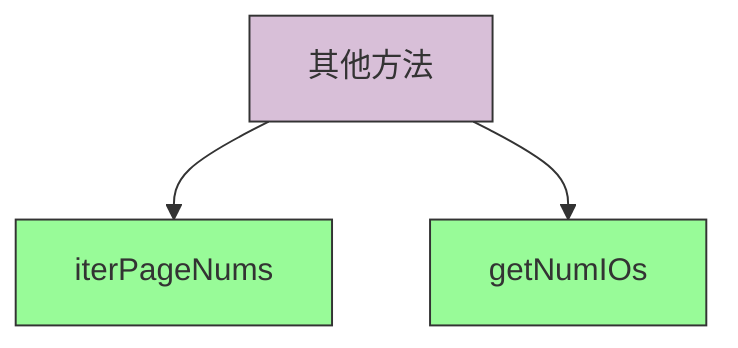
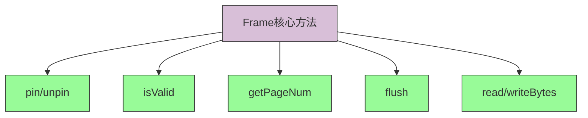

# BufferManager API 文档

## BufferManager 类结构图



## 核心API说明

### 构造函数



**BufferManager(DiskSpaceManager diskSpaceManager, RecoveryManager recoveryManager, int numFrames, EvictionPolicy evictionPolicy)**
```java
/**
 * 创建一个新的缓冲区管理器实例
 * @param diskSpaceManager 底层磁盘空间管理器
 * @param recoveryManager 恢复管理器
 * @param numFrames 缓冲区大小（以页为单位）
 * @param evictionPolicy 页面置换策略
 */
public BufferManager(DiskSpaceManager diskSpaceManager, RecoveryManager recoveryManager, 
                     int numFrames, EvictionPolicy evictionPolicy) {
    this.diskSpaceManager = diskSpaceManager;
    this.recoveryManager = recoveryManager;
    this.frames = new HashMap<>();
    this.evictionPolicy = evictionPolicy;
    this.frameLocks = new ReentrantLock[numFrames];
    this.numIOs = new AtomicLong(0);
    for (int i = 0; i < numFrames; ++i) {
        this.frameLocks[i] = new ReentrantLock();
    }
    this.evictionPolicy.init(numFrames);
}
```

### 页面操作方法



1. **fetchPage(LockContext parentContext, long pageNum)**
```java
/**
 * 获取指定页面，返回已加载并锁定的缓冲区帧包装的页面对象
 * @param parentContext 页面父级的锁上下文
 * @param pageNum 页面编号
 * @return 指定的页面
 */
public Page fetchPage(LockContext parentContext, long pageNum) {
    // 实现细节...
}
```

2. **fetchNewPage(LockContext parentContext, int partNum)**
```java
/**
 * 获取一个新页面，返回已加载并锁定的缓冲区帧包装的新页面对象
 * @param parentContext 新页面的父级锁上下文
 * @param partNum 新页面的分区号
 * @return 新页面
 */
public Page fetchNewPage(LockContext parentContext, int partNum) {
    // 实现细节...
}
```

3. **freePage(Page page)**
```java
/**
 * 释放一个页面 - 从缓存中驱逐该页面，并通知磁盘空间管理器该页面不再需要
 * @param page 要释放的页面
 */
public void freePage(Page page) {
    // 实现细节...
}
```

4. **freePart(int partNum)**
```java
/**
 * 释放一个分区 - 从缓存中驱逐所有相关页面，并通知磁盘空间管理器该分区不再需要
 * @param partNum 要释放的分区号
 */
public void freePart(int partNum) {
    // 实现细节...
}
```

### 驱逐操作方法



1. **evict(long pageNum)**
```java
/**
 * 调用页面帧的flush方法并将页面从帧中卸载
 * @param pageNum 要驱逐的页面号
 */
public void evict(long pageNum) {
    // 实现细节...
}
```

2. **evictAll()**
```java
/**
 * 按顺序对每个帧调用evict方法
 */
public void evictAll() {
    // 实现细节...
}
```

### 其他重要方法



1. **iterPageNums(BiConsumer<Long, Boolean> process)**
```java
/**
 * 对每个已加载页面的页面号调用传入的方法
 * @param process 处理页面号的方法。第一个参数是页面号，第二个参数是表示页面是否脏（有未刷新更改）的布尔值
 */
public void iterPageNums(BiConsumer<Long, Boolean> process) {
    // 实现细节...
}
```

2. **getNumIOs()**
```java
/**
 * 获取自缓冲区管理器启动以来的I/O操作数（不包括磁盘空间管理中使用的任何内容）
 * @return I/O操作数
 */
public long getNumIOs() {
    return this.numIOs.get();
}
```

## Frame 内部类

Frame 类代表缓冲区中的单个页面帧，继承自 BufferFrame。它封装了页面的内容以及相关的元数据。

### 核心方法



1. **pin()**
```java
/**
 * 锁定缓冲区帧；在锁定期间不能被驱逐。当缓冲区帧被锁定时会发生"命中"。
 */
@Override
public void pin() {
    // 实现细节...
}
```

2. **unpin()**
```java
/**
 * 解锁缓冲区帧。
 */
@Override
public void unpin() {
    // 实现细节...
}
```

3. **isValid()**
```java
/**
 * 检查此帧是否有效
 * @return 如果帧有效返回true
 */
@Override
public boolean isValid() {
    return this.pageNum != INVALID_PAGE_NUM;
}
```

4. **getPageNum()**
```java
/**
 * 获取此帧的页面号
 * @return 页面号
 */
@Override
public long getPageNum() {
    return this.pageNum;
}
```

5. **flush()**
```java
/**
 * 将此缓冲区帧刷新到磁盘，但不卸载它。
 */
@Override
void flush() {
    // 实现细节...
}
```

6. **readBytes(short position, short num, byte[] buf)**
```java
/**
 * 从缓冲区帧读取数据
 * @param position 开始读取的位置
 * @param num 要读取的字节数
 * @param buf 输出缓冲区
 */
@Override
void readBytes(short position, short num, byte[] buf) {
    // 实现细节...
}
```

7. **writeBytes(short position, short num, byte[] buf)**
```java
/**
 * 写入数据到缓冲区帧，并标记帧为脏
 * @param position 开始写入的位置
 * @param num 要写入的字节数
 * @param buf 输入缓冲区
 */
@Override
void writeBytes(short position, short num, byte[] buf) {
    // 实现细节...
}
```

## 常量

- `RESERVED_SPACE`: 为恢复簿记保留的字节数（36字节）
- `EFFECTIVE_PAGE_SIZE`: 缓冲区管理器用户可用的有效页面大小

## 设计特点

1. **页面替换策略可插拔**：支持不同的页面替换算法（LRU、Clock等）
2. **线程安全**：使用锁机制保证并发访问的安全性
3. **恢复支持**：与ARIES恢复协议集成，记录页面修改日志
4. **高效内存管理**：通过帧复用减少内存分配开销