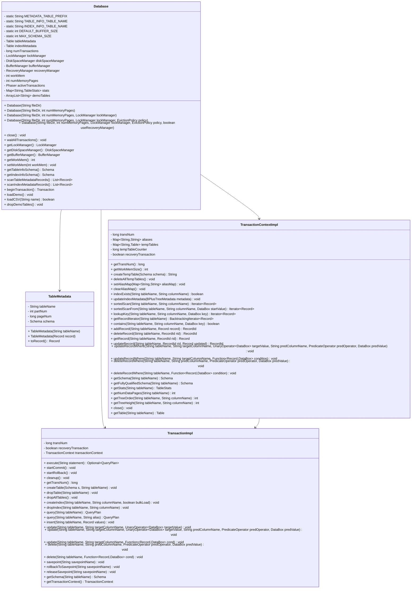
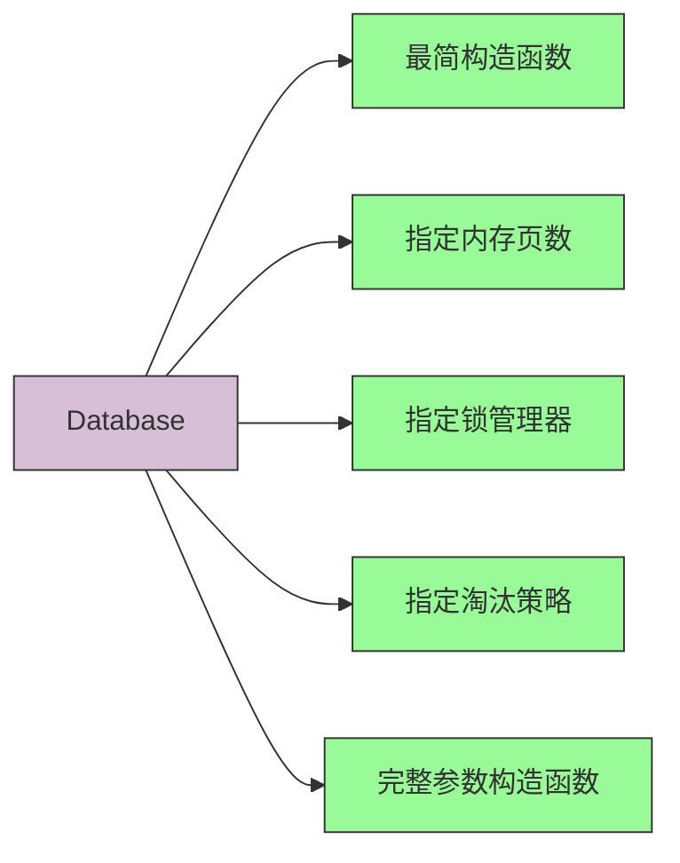
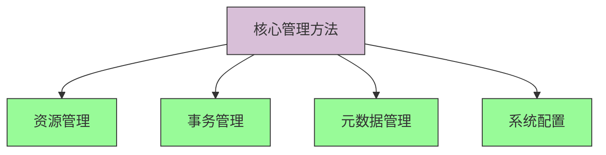
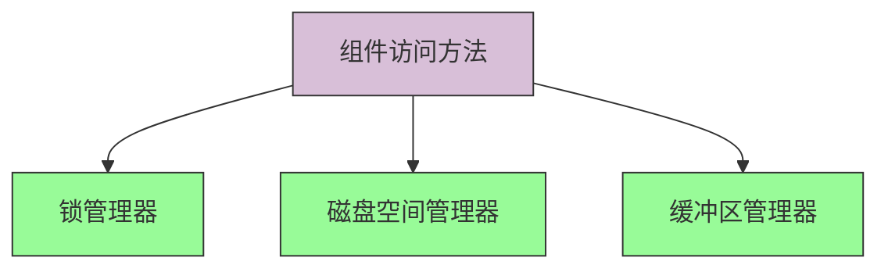
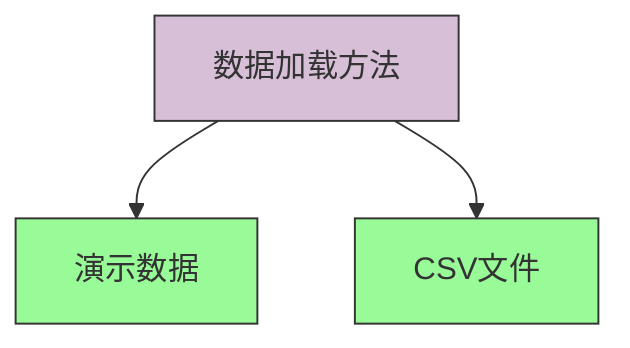

# Database API 文档

## Database 类结构图



## 核心API说明

### 构造函数



1. **最简构造函数**
```java
/**
 * 创建一个新的数据库，具有以下默认设置：
 * - 默认缓冲区大小
 * - 锁定禁用（DummyLockManager）
 * - 时钟淘汰策略
 * - 恢复管理器禁用（DummyRecoverManager）
 * @param fileDir 存放表文件的目录
 */
public Database(String fileDir) {
    this (fileDir, DEFAULT_BUFFER_SIZE);
}
```

2. **指定内存页数**
```java
/**
 * 创建一个新的数据库，具有以下默认设置：
 * - 锁定禁用（DummyLockManager）
 * - 时钟淘汰策略
 * - 恢复管理器禁用（DummyRecoverManager）
 * @param fileDir 存放表文件的目录
 * @param numMemoryPages 缓冲区缓存中的内存页数
 */
public Database(String fileDir, int numMemoryPages) {
    this(fileDir, numMemoryPages, new DummyLockManager());
}
```

3. **指定锁管理器**
```java
/**
 * 创建一个新的数据库，具有以下默认设置：
 * - 时钟淘汰策略
 * - 恢复管理器禁用（DummyRecoverManager）
 * @param fileDir 存放表文件的目录
 * @param numMemoryPages 缓冲区缓存中的内存页数
 * @param lockManager 锁管理器
 */
public Database(String fileDir, int numMemoryPages, LockManager lockManager) {
    this(fileDir, numMemoryPages, lockManager, new ClockEvictionPolicy());
}
```

4. **指定淘汰策略**
```java
/**
 * 创建一个新的数据库，恢复功能禁用（DummyRecoveryManager）
 * @param fileDir 存放表文件的目录
 * @param numMemoryPages 缓冲区缓存中的内存页数
 * @param lockManager 锁管理器
 * @param policy 缓冲区缓存的淘汰策略
 */
public Database(String fileDir, int numMemoryPages, LockManager lockManager, EvictionPolicy policy) {
    this(fileDir, numMemoryPages, lockManager, policy, false);
}
```

5. **完整参数构造函数**
```java
/**
 * 创建一个新的数据库。
 * @param fileDir 存放表文件的目录
 * @param numMemoryPages 缓冲区缓存中的内存页数
 * @param lockManager 锁管理器
 * @param policy 缓冲区缓存的淘汰策略
 * @param useRecoveryManager 启用或禁用恢复管理器（ARIES）的标志
 */
public Database(String fileDir, int numMemoryPages, LockManager lockManager, EvictionPolicy policy, boolean useRecoveryManager) {
    boolean initialized = setupDirectory(fileDir);
    numTransactions = 0;
    this.numMemoryPages = numMemoryPages;
    this.lockManager = lockManager;
    
    if (useRecoveryManager) {
        recoveryManager = new ARIESRecoveryManager(this::beginRecoveryTransaction);
    } else {
        recoveryManager = new DummyRecoveryManager();
    }
    
    diskSpaceManager = new DiskSpaceManagerImpl(fileDir, recoveryManager);
    bufferManager = new BufferManager(diskSpaceManager, recoveryManager, numMemoryPages, policy);
    
    // 创建日志分区
    if (!initialized) diskSpaceManager.allocPart(0);
    
    // 执行恢复
    recoveryManager.setManagers(diskSpaceManager, bufferManager);
    if (!initialized) recoveryManager.initialize();
    recoveryManager.restart();
    
    Transaction initTransaction = beginTransaction();
    
    if (!initialized) {
        // _metadata.tables 分区和 _metadata.indices 分区
        diskSpaceManager.allocPart(1);
        diskSpaceManager.allocPart(2);
    }
    if (!initialized) {
        this.initTableInfo();
        this.initIndexInfo();
    } else {
        this.loadMetadataTables();
    }
    initTransaction.commit();
}
```

### 核心管理方法



#### 资源管理

1. **close()**
```java
/**
 * 关闭数据库
 */
@Override
public synchronized void close() {
    // 等待所有事务终止
    this.waitAllTransactions();
    
    dropDemoTables();
    
    this.bufferManager.evictAll();
    
    this.recoveryManager.close();
    
    this.tableMetadata = null;
    this.indexMetadata = null;
    
    this.bufferManager.close();
    this.diskSpaceManager.close();
}
```

2. **waitAllTransactions()**
```java
// 等待所有事务完成
public synchronized void waitAllTransactions() {
    while (!activeTransactions.isTerminated()) {
        activeTransactions.awaitAdvance(activeTransactions.getPhase());
    }
}
```

#### 事务管理

**beginTransaction()**
```java
/**
 * 开始一个新事务
 * @return 新的Transaction对象
 */
public synchronized Transaction beginTransaction() {
    TransactionImpl t = new TransactionImpl(this.numTransactions, false);
    activeTransactions.register();
    if (activeTransactions.isTerminated()) {
        activeTransactions = new Phaser(1);
    }
    this.recoveryManager.startTransaction(t);
    ++this.numTransactions;
    TransactionContext.setTransaction(t.getTransactionContext());
    return t;
}
```

#### 元数据管理

1. **getTableInfoSchema()**
```java
/**
 * @return _metadata.tables的Schema，包含以下字段:
 *   | 字段名         | 字段类型
 * --+--------------+-------------------------
 * 0 | table_name   | string(32)
 * 1 | part_num     | int
 * 2 | page_num     | long
 * 3 | schema       | byte array(MAX_SCHEMA_SIZE)
 */
public Schema getTableInfoSchema() {
    return new Schema()
            .add("table_name", Type.stringType(32))
            .add("part_num", Type.intType())
            .add("page_num", Type.longType())
            .add("schema", Type.byteArrayType(MAX_SCHEMA_SIZE));
}
```

2. **getIndexInfoSchema()**
```java
/**
 * @return _metadata.indices的Schema，包含以下字段:
 *   | 字段名                | 字段类型
 * --+---------------------+------------
 * 0 | table_name          | string(32)
 * 1 | col_name            | string(32)
 * 2 | order               | int
 * 3 | part_num            | int
 * 4 | root_page_num       | long
 * 5 | key_schema_typeid   | int
 * 6 | key_schema_typesize | int
 * 7 | height              | int
 */
public Schema getIndexInfoSchema() {
    return new Schema()
            .add("table_name", Type.stringType(32))
            .add("col_name", Type.stringType(32))
            .add("order", Type.intType())
            .add("part_num", Type.intType())
            .add("root_page_num", Type.longType())
            .add("key_schema_typeid", Type.intType())
            .add("key_schema_typesize", Type.intType())
            .add("height", Type.intType());
}
```

#### 系统配置

1. **getWorkMem()**
```java
public int getWorkMem() {
    // 限制工作内存不超过内存页数，避免内存溢出错误
    return Math.min(this.workMem, this.numMemoryPages);
}
```

2. **setWorkMem(int workMem)**
```java
public void setWorkMem(int workMem) {
    this.workMem = workMem;
}
```

### 组件访问方法



1. **getLockManager()**
```java
public LockManager getLockManager() {
    return lockManager;
}
```

2. **getDiskSpaceManager()**
```java
public DiskSpaceManager getDiskSpaceManager() {
    return diskSpaceManager;
}
```

3. **getBufferManager()**
```java
public BufferManager getBufferManager() {
    return bufferManager;
}
```

### 数据加载方法



1. **loadDemo()**
```java
public void loadDemo() throws IOException {
    demoTables = new ArrayList<>(Arrays.asList("Students", "Courses", "Enrollments"));
    
    dropDemoTables();
    
    for (String table: demoTables) {
        loadCSV(table);
    }
    
    waitAllTransactions();
    getBufferManager().evictAll();
}
```

2. **loadCSV(String name)**
```java
/**
 * 从src/main/resources中加载CSV文件作为表
 * @param name CSV文件名（不包括.csv扩展名）
 * @return 如果表已存在于数据库中则返回true，否则返回false
 */
public boolean loadCSV(String name) throws IOException {
    // 实现细节...
}
```

## 内部类

### TableMetadata
表示表的元数据信息

```java
private static class TableMetadata {
    String tableName;
    int partNum;
    long pageNum;
    Schema schema;
    
    TableMetadata(String tableName) {
        this.tableName = tableName;
        this.partNum = -1;
        this.pageNum = -1;
        this.schema = new Schema();
    }
    
    TableMetadata(Record record) {
        tableName = record.getValue(0).getString();
        partNum = record.getValue(1).getInt();
        pageNum = record.getValue(2).getLong();
        schema = Schema.fromBytes(ByteBuffer.wrap(record.getValue(3).toBytes()));
    }
    
    Record toRecord() {
        byte[] schemaBytes = schema.toBytes();
        byte[] padded = new byte[MAX_SCHEMA_SIZE];
        System.arraycopy(schemaBytes, 0, padded, 0, schemaBytes.length);
        return new Record(tableName, partNum, pageNum, padded);
    }
}
```

### TransactionContextImpl
事务上下文实现类，提供对数据库资源的底层访问

### TransactionImpl
事务实现类，提供面向用户的事务操作接口

## 使用示例

```java
// 创建数据库实例
Database db = new Database("data");

// 开始事务
try (Transaction transaction = db.beginTransaction()) {
    // 创建表
    Schema schema = new Schema()
        .add("id", Type.INT(10))
        .add("name", Type.VARCHAR(50));
    transaction.createTable(schema, "users");
    
    // 插入数据
    List<DataBox> values = Arrays.asList(new IntDataBox(1), new StringDataBox("Alice", 50));
    transaction.insert("users", new Record(values));
    
    // 提交事务
    transaction.commit();
}

// 关闭数据库
db.close();
```