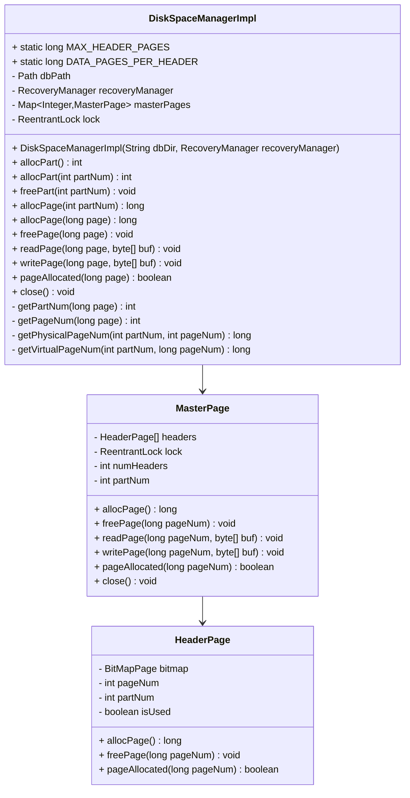
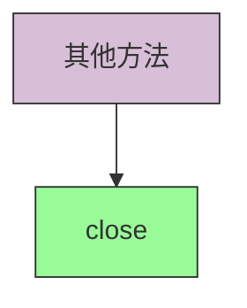

# DiskSpaceManagerImpl API 文档

## DiskSpaceManagerImpl 类结构图



## 核心API说明

### 构造函数


**DiskSpaceManagerImpl(String dbDir, RecoveryManager recoveryManager)**
```java
/**
 * 使用给定目录初始化磁盘空间管理器。如果目录不存在则创建该目录。
 * @param dbDir 数据库的基本目录路径
 * @param recoveryManager 恢复管理器
 */
public DiskSpaceManagerImpl(String dbDir, RecoveryManager recoveryManager) {
    // 实现细节...
}
```

### 分区操作方法

```mermaid
graph TD
    A[分区操作] --> B[allocPart()]
    A --> C[allocPart(int)]
    A --> D[freePart]
    
    style A fill:#d8bfd8,stroke:#333
    style B fill:#98fb98,stroke:#333
    style C fill:#98fb98,stroke:#333
    style D fill:#98fb98,stroke:#333
```

1. **allocPart()**
```java
/**
 * 分配一个新的分区，返回分区号。
 * @return 新分配的分区号
 */
@Override
public int allocPart() {
    // 实现细节...
}
```

2. **allocPart(int partNum)**
```java
/**
 * 分配一个指定分区号的分区。
 * @param partNum 指定的分区号
 * @return 分区号
 */
@Override
public int allocPart(int partNum) {
    // 实现细节...
}
```

3. **freePart(int partNum)**
```java
/**
 * 释放指定的分区。
 * @param partNum 要释放的分区号
 */
@Override
public void freePart(int partNum) {
    // 实现细节...
}
```

### 页面操作方法

```mermaid
graph TD
    A[页面操作] --> B[allocPage(int)]
    A --> C[allocPage(long)]
    A --> D[freePage]
    A --> E[readPage]
    A --> F[writePage]
    A --> G[pageAllocated]
    
    style A fill:#d8bfd8,stroke:#333
    style B fill:#98fb98,stroke:#333
    style C fill:#98fb98,stroke:#333
    style D fill:#98fb98,stroke:#333
    style E fill:#98fb98,stroke:#333
    style F fill:#98fb98,stroke:#333
    style G fill:#98fb98,stroke:#333
```

1. **allocPage(int partNum)**
```java
/**
 * 在指定分区中分配一个新页面。
 * @param partNum 分区号
 * @return 分配的虚拟页面号
 */
@Override
public long allocPage(int partNum) {
    // 实现细节...
}
```

2. **allocPage(long page)**
```java
/**
 * 分配一个指定页面号的页面。
 * @param page 虚拟页面号
 * @return 分配的虚拟页面号
 */
@Override
public long allocPage(long page) {
    // 实现细节...
}
```

3. **freePage(long page)**
```java
/**
 * 释放指定的页面。
 * @param page 虚拟页面号
 */
@Override
public void freePage(long page) {
    // 实现细节...
}
```

4. **readPage(long page, byte[] buf)**
```java
/**
 * 读取指定页面的内容到缓冲区。
 * @param page 虚拟页面号
 * @param buf 用于存储页面内容的缓冲区（必须是页面大小）
 */
@Override
public void readPage(long page, byte[] buf) {
    // 实现细节...
}
```

5. **writePage(long page, byte[] buf)**
```java
/**
 * 将缓冲区内容写入指定页面。
 * @param page 虚拟页面号
 * @param buf 包含要写入数据的缓冲区（必须是页面大小）
 */
@Override
public void writePage(long page, byte[] buf) {
    // 实现细节...
}
```

6. **pageAllocated(long page)**
```java
/**
 * 检查指定页面是否已经分配。
 * @param page 虚拟页面号
 * @return 如果页面已分配返回true，否则返回false
 */
@Override
public boolean pageAllocated(long page) {
    // 实现细节...
}
```

### 其他重要方法



**close()**
```java
/**
 * 关闭磁盘空间管理器，释放所有资源。
 */
@Override
public void close() {
    // 实现细节...
}
```

## 常量

- `MAX_HEADER_PAGES`: 每个页眉页面的最大数量 (PAGE_SIZE / 2)
- `DATA_PAGES_PER_HEADER`: 每个页眉页面管理的数据页面数量 (PAGE_SIZE * 8)

## 设计特点

1. **两级页眉结构**：
   - 主页面(Master Page)存储每个页眉页面的分配计数
   - 页眉页面(Header Page)存储数据页面分配的位图

2. **虚拟页面号码格式**：
   - 格式为：分区号 * 10^10 + n（第n个数据页面）
   - 这种格式便于调试和识别页面归属

3. **文件组织结构**：
   - 主页面是OS文件的第0页
   - 第一个页眉页面是OS文件的第1页
   - 后续是数据页面和其他页眉页面

4. **内存缓存**：
   - 主页面和页眉页面永久缓存在内存中
   - 对这些页面的更改会立即刷新到磁盘

5. **并发控制**：
   - 使用锁机制保证多线程环境下的安全性
   - 每个分区有自己的锁

## 页面号码转换

虚拟页面号码采用64位整数(long)格式：
```
分区号 * 10^10 + n
```
其中n是该分区的第n个数据页面（从0开始索引）。