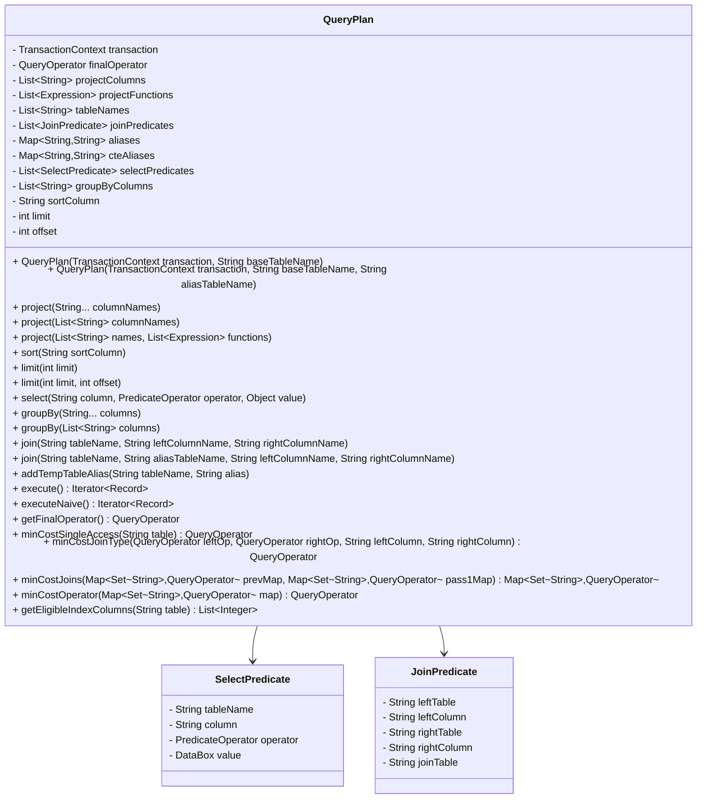
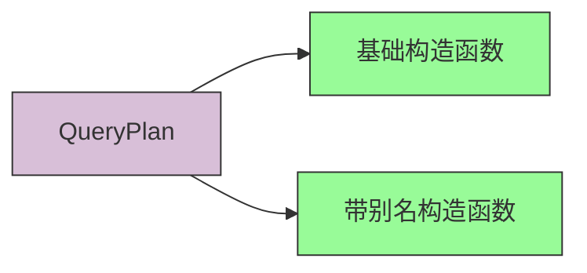
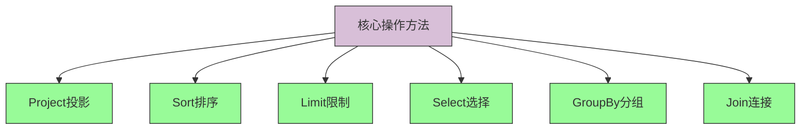

# QueryPlan API 文档

## QueryPlan 类结构图



## 核心API说明

### 构造函数



1. **基础构造函数**
```java
/**
 * 在transaction中创建一个新的QueryPlan，基表为baseTableName
 * @param transaction 包含此查询的事务
 * @param baseTableName 此查询的源表
 */
public QueryPlan(TransactionContext transaction, String baseTableName) {
    this(transaction, baseTableName, baseTableName);
}
```

2. **带别名构造函数**
```java
/**
 * 在transaction中创建一个新的QueryPlan，基表为startTableName
 * 并将其别名为aliasTableName。
 * @param transaction 包含此查询的事务
 * @param baseTableName 此查询的源表
 * @param aliasTableName 源表的别名
 */
public QueryPlan(TransactionContext transaction, String baseTableName, String aliasTableName) {
    this.transaction = transaction;
    // 我们的表到目前为止只包含基表
    this.tableNames = new ArrayList<>();
    this.tableNames.add(aliasTableName);
    // 处理别名
    this.aliases = new HashMap<>();
    this.cteAliases = new HashMap<>();
    this.aliases.put(aliasTableName, baseTableName);
    this.transaction.setAliasMap(this.aliases);
    // 随着用户添加project、select等操作，这些将会被填充...
    this.projectColumns = new ArrayList<>();
    this.projectFunctions = null;
    this.joinPredicates = new ArrayList<>();
    this.selectPredicates = new ArrayList<>();
    this.groupByColumns = new ArrayList<>();
    this.limit = -1;
    this.offset = 0;
    // 这将在调用execute()后设置
    this.finalOperator = null;
}
```

### 核心操作方法



#### Project 投影操作

1. **project(String... columnNames)**
```java
/**
 * 向QueryPlan添加一个投影操作符，指定要投影的列名。
 * @param columnNames 要投影的列
 * @throws RuntimeException 已经指定了投影集合。
 */
public void project(String...columnNames) {
    project(Arrays.asList(columnNames));
}
```

2. **project(List<String> columnNames)**
```java
/**
 * 向QueryPlan添加一个投影操作符，指定要投影的列名列表。只能指定一组投影。
 * @param columnNames 要投影的列
 * @throws RuntimeException 已经指定了投影集合。
 */
public void project(List<String> columnNames) {
    if (!this.projectColumns.isEmpty()) {
        throw new RuntimeException("不能为此查询添加多个投影操作符。");
    }
    if (columnNames.isEmpty()) {
        throw new RuntimeException("不能不投影任何列。");
    }
    this.projectColumns = new ArrayList<>(columnNames);
}
```

3. **project(List<String> names, List<Expression> functions)**
```java
/**
 * 向QueryPlan添加一个投影操作符，指定要投影的列名列表。
 * 带上一些表达式函数
 */
public void project(List<String> names, List<Expression> functions) {
    this.projectColumns = names;
    this.projectFunctions = functions;
}
```

#### Sort 排序操作

**sort(String sortColumn)**
```java
/**
 * 向查询计划添加排序操作符，按给定列进行排序。
 */
public void sort(String sortColumn) {
    if (sortColumn == null) throw new UnsupportedOperationException("只支持一个排序列");
    this.sortColumn = sortColumn;
}
```

#### Limit 限制操作

1. **limit(int limit)**
```java
/**
 * 添加一个没有偏移量的限制
 * @param limit 要生成的记录数的上限
 */
public void limit(int limit) {
    this.limit(limit, 0);
}
```

2. **limit(int limit, int offset)**
```java
/**
 * 添加一个带偏移量的限制
 * @param limit 要生成的记录数的上限
 * @param offset 在生成第一条记录之前丢弃的记录数
 */
public void limit(int limit, int offset) {
    this.limit = limit;
    this.offset = offset;
}
```

#### Select 选择操作

**select(String column, PredicateOperator operator, Object value)**
```java
/**
 * 添加一个选择操作符。只返回满足相对于value的谓词条件的列。
 * @param column 指定谓词的列
 * @param operator 谓词的操作符 (=, <, <=, >, >=, !=)
 * @param value 用于比较的值
 */
public void select(String column, PredicateOperator operator, Object value) {
    DataBox d = DataBox.fromObject(value);
    this.selectPredicates.add(new SelectPredicate(column, operator, d));
}
```

#### GroupBy 分组操作

1. **groupBy(String...columns)**
```java
/**
 * 为查询设置分组列。
 * @param columns 要分组的列
 */
public void groupBy(String...columns) {
    this.groupByColumns = Arrays.asList(columns);
}
```

2. **groupBy(List<String> columns)**
```java
/**
 * 为查询设置分组列。
 * @param columns 要分组的列
 */
public void groupBy(List<String> columns) {
    this.groupByColumns = columns;
}
```

#### Join 连接操作

1. **join(String tableName, String leftColumnName, String rightColumnName)**
```java
/**
 * 将现有查询计划的 leftColumnName 列与 tableName 表的 rightColumnName 列进行连接。
 * @param tableName 要连接的表
 * @param leftColumnName 现有 QueryPlan 中的连接列
 * @param rightColumnName tableName 中的连接列
 */
public void join(String tableName, String leftColumnName, String rightColumnName) {
    join(tableName, tableName, leftColumnName, rightColumnName);
}
```

2. **join(String tableName, String aliasTableName, String leftColumnName, String rightColumnName)**
```java
/**
 * 将现有查询计划的 leftColumnName 列与 tableName 表的 rightColumnName 列进行连接，
 * 并将 tableName 表别名为 aliasTableName。
 * baseTable join tableName as aliasTableName On predicates
 * @param tableName 要连接的表
 * @param aliasTableName 要连接的表的别名
 * @param leftColumnName 现有 QueryPlan 中的连接列
 * @param rightColumnName tableName 中的连接列
 */
public void join(String tableName, String aliasTableName, String leftColumnName, String rightColumnName) {
    // 检查别名，如果已存在，则抛出异常
    if (this.aliases.containsKey(aliasTableName)) {
        throw new RuntimeException("table/alias " + aliasTableName + " 已在使用中");
    }
    if (cteAliases.containsKey(tableName)) {
        tableName = cteAliases.get(tableName);
    }
    this.aliases.put(aliasTableName, tableName);
    // 添加连接谓词
    this.joinPredicates.add(new JoinPredicate(aliasTableName, leftColumnName, rightColumnName));
    // 添加表名
    this.tableNames.add(aliasTableName);
    // 设置别名
    this.transaction.setAliasMap(this.aliases);
}
```

### 其他重要方法

#### 别名管理

**addTempTableAlias(String tableName, String alias)**
```java
/**
 * 添加临时表的别名
 */
public void addTempTableAlias(String tableName, String alias) {
    if (cteAliases.containsKey(alias)) {
        throw new UnsupportedOperationException("重复的别名 " + alias);
    }
    cteAliases.put(alias, tableName);
    for (String k: aliases.keySet()) {
        if (aliases.get(k).toLowerCase().equals(alias.toLowerCase())) {
            aliases.put(k, tableName);
        }
    }
    this.transaction.setAliasMap(this.aliases);
}
```

#### 执行方法

1. **execute()**
```java
/**
 * 基于 System R 成本基础查询优化器生成优化的 QueryPlan。
 * @return 作为此查询结果的记录迭代器
 */
public Iterator<Record> execute() {
    this.transaction.setAliasMap(this.aliases);
    // TODO(proj3_part2): implement
    // Pass 1: For each table, find the lowest cost QueryOperator to access
    // the table. Construct a mapping of each table name to its lowest cost
    // operator.
    //
    // Pass i: On each pass, use the results from the previous pass to find
    // the lowest cost joins with each table from pass 1. Repeat until all
    // tables have been joined.
    //
    // Set the final operator to the lowest cost operator from the last
    // pass, add group by, project, sort and limit operators, and return an
    // iterator over the final operator.
    return this.executeNaive(); // TODO(proj3_part2): Replace this!
}
```

2. **executeNaive()**
```java
/**
 * 生成一个简单的 QueryPlan，其中所有连接都在 DAG 的底部，
 * 接着是所有选择谓词，可选的 group by 操作符，可选的 project 操作符，
 * 可选的 sort 操作符和可选的 limit 操作符（按此顺序）。
 * @return 作为此查询结果的记录迭代器
 */
public Iterator<Record> executeNaive() {
    this.transaction.setAliasMap(this.aliases);
    int indexPredicate = this.getEligibleIndexColumnNaive();
    if (indexPredicate != -1) {
        this.generateIndexPlanNaive(indexPredicate);
    } else {
        // 从第一个表的扫描开始
        this.finalOperator = new SequentialScanOperator(this.transaction, this.tableNames.get(0));
        // 向我们的计划添加连接、选择、分组和投影
        this.addJoinsNaive();
        this.addSelectsNaive();
        this.addGroupBy();
        this.addProject();
        this.addSort();
        this.addLimit();
    }
    return this.finalOperator.iterator();
}
```

#### 获取最终操作符

**getFinalOperator()**
```java
public QueryOperator getFinalOperator() {
    return this.finalOperator;
}
```

### 优化相关方法

#### 单表访问优化

**minCostSingleAccess(String table)**
```java
/**
 * 查找访问给定表的最低成本 QueryOperator。首先确定给定表的顺序扫描成本。
 * 然后对于该表上每个可用的索引，确定索引扫描的成本。跟踪最小成本操作并下推符合条件的选择谓词。
 * 如果选择了索引扫描，在下推选择条件时排除冗余的选择谓词。
 * 此方法将在搜索算法的第一遍中调用，以确定访问每个表的最有效方式。
 * @return 一个具有扫描给定表最低成本的 QueryOperator，它可以是 SequentialScanOperator
 * 或嵌套在任何可能的下推选择操作符中的 IndexScanOperator。最低成本操作符的平局可以任意打破。
 * 这个函数就是给一个表名，然后返回一个访问该表的最优操作符
 */
public QueryOperator minCostSingleAccess(String table) {
    QueryOperator minOp = new SequentialScanOperator(this.transaction, table);
    // TODO(proj3_part2): implement
    return minOp;
}
```

**getEligibleIndexColumns(String table)**
```java
/**
 * 获取给定表中可以使用索引扫描的所有选择谓词的索引位置。
 * 一个谓词可以使用索引扫描需要满足以下条件：
 * 1. 该谓词作用于指定的表
 * 2. 该表的对应列上存在索引
 * 3. 操作符不是NOT_EQUALS（因为不等于操作无法有效利用索引）
 * @param table 表名
 * @return 包含可使用索引扫描的选择谓词在selectPredicates列表中索引位置的列表
 */
private List<Integer> getEligibleIndexColumns(String table) {
    List<Integer> result = new ArrayList<>();
    // 遍历所有选择谓词
    for (int i = 0; i < this.selectPredicates.size(); i++) {
        SelectPredicate p = this.selectPredicates.get(i);
        // 忽略针对不同表的选择谓词
        if (!p.tableName.equals(table)) continue;
        // 检查该列是否存在索引
        boolean indexExists = this.transaction.indexExists(table, p.column);
        // 检查操作符是否可以使用索引扫描
        boolean canScan = p.operator != PredicateOperator.NOT_EQUALS;
        if (indexExists && canScan) result.add(i);
    }
    return result;
}
```

#### 连接优化

**minCostJoinType(QueryOperator leftOp, QueryOperator rightOp, String leftColumn, String rightColumn)**
```java
/**
 * 运用开销最小的连接操作符
 * 给定左右操作符之间的连接谓词，从 JoinOperator.JoinType 中找到成本最低的连接操作符。
 * 默认情况下只考虑 SNLJ 和 BNLJ，以防止依赖 GHJ、Sort 和 SMJ。
 * 提醒：您的实现不需要考虑笛卡尔积，也不需要跟踪有趣的排序。
 * @return 输入操作符之间成本最低的连接 QueryOperator
 */
private QueryOperator minCostJoinType(QueryOperator leftOp, QueryOperator rightOp, String leftColumn, String rightColumn) {
    // 作用后两个操作符变成一个Join操作符
    QueryOperator bestOperator = null;
    // 开始选择最小成本的
    int minimumCost = Integer.MAX_VALUE;
    List<QueryOperator> allJoins = new ArrayList<>();
    // 仅考虑 SNLJ BNLJ
    allJoins.add(new SNLJOperator(leftOp, rightOp, leftColumn, rightColumn, this.transaction));
    allJoins.add(new BNLJOperator(leftOp, rightOp, leftColumn, rightColumn, this.transaction));
    for (QueryOperator join : allJoins) {
        int joinCost = join.estimateIOCost();
        if (joinCost < minimumCost) {
            bestOperator = join;
            minimumCost = joinCost;
        }
    }
    return bestOperator;
}
```

**minCostJoins(Map<Set<String>, QueryOperator> prevMap, Map<Set<String>, QueryOperator> pass1Map)**
```java
/**
 * 遍历搜索的前一遍中的所有表集合。对于每个表集合，检查每个连接谓词看是否存在与新表的有效连接。
 * 如果存在，则找到成本最低的连接。返回一个从正在连接的每个表名集合到其最低成本连接操作符的映射。
 * 连接谓词存储为 this.joinPredicates 的元素。
 * @param prevMap 将表集合映射到该表集合上的查询操作符。每个集合应该有 pass number - 1 个元素。
 * @param pass1Map 每个集合恰好包含一个表，映射到单个表访问（扫描）查询操作符。
 * @return 一个从表名到连接 QueryOperator 的映射。每个表名集合中的元素数量应该等于遍历次数。
 */
public Map<Set<String>, QueryOperator> minCostJoins(Map<Set<String>, QueryOperator> prevMap, Map<Set<String>, QueryOperator> pass1Map) {
    Map<Set<String>, QueryOperator> result = new HashMap<>();
    // TODO(proj3_part2): implement
    // We provide a basic description of the logic you have to implement:
    // For each set of tables in prevMap
    //   For each join predicate listed in this.joinPredicates
    //      Get the left side and the right side of the predicate (table name and column)
    //
    //      Case 1: The set contains left table but not right, use pass1Map
    //              to fetch an operator to access the rightTable
    //      Case 2: The set contains right table but not left, use pass1Map
    //              to fetch an operator to access the leftTable.
    //      Case 3: Otherwise, skip this join predicate and continue the loop.
    //
    //      Using the operator from Case 1 or 2, use minCostJoinType to
    //      calculate the cheapest join with the new table (the one you
    //      fetched an operator for from pass1Map) and the previously joined
    //      tables. Then, update the result map if needed.
    return result;
}
```

#### 最低成本操作符选择

**minCostOperator(Map<Set<String>, QueryOperator> map)**
```java
/**
 * 在给定映射中查找成本最低的 QueryOperator。映射是在搜索算法的每次遍历中生成的，
 * 并将表集合关联到访问这些表的成本最低的 QueryOperator。
 * @return 给定映射中的一个 QueryOperator
 */
private QueryOperator minCostOperator(Map<Set<String>, QueryOperator> map) {
    if (map.size() == 0) throw new IllegalArgumentException("无法在空映射上找到最小成本操作符");
    QueryOperator minOp = null;
    int minCost = Integer.MAX_VALUE;
    for (Set<String> tables : map.keySet()) {
        QueryOperator currOp = map.get(tables);
        int currCost = currOp.estimateIOCost();
        if (currCost < minCost) {
            minOp = currOp;
            minCost = currCost;
        }
    }
    return minOp;
}
```

### 辅助类

#### SelectPredicate
表示单个选择谓词。例如：`table1.col = 186`

```java
private class SelectPredicate {
    String tableName;
    String column;
    PredicateOperator operator;
    DataBox value;

    SelectPredicate(String column, PredicateOperator operator, DataBox value) {
        if (column.contains(".")) {
            this.tableName = column.split("\\.")[0];
            column = column.split("\\.")[1];
        }  else {
            this.tableName = resolveColumn(column);
        }
        this.column = column;
        this.operator = operator;
        this.value = value;
    }

    @Override
    public String toString() {
        return String.format("%s.%s %s %s", tableName, column, operator.toSymbol(), value);
    }
}
```

#### JoinPredicate
表示查询计划中的等值连接。例如：`INNER JOIN rightTable ON leftTable.leftColumn = rightTable.rightColumn`

```java
private class JoinPredicate {
    String leftTable;
    String leftColumn;
    String rightTable;
    String rightColumn;
    private String joinTable; // 仅用于格式化目的

    JoinPredicate(String tableName, String leftColumn, String rightColumn) {
        if (!leftColumn.contains(".") || !rightColumn.contains(".")) {
            throw new IllegalArgumentException("连接列必须完全限定");
        }
        // 下面的分割逻辑只是将列名从表名中分离出来。
        this.joinTable = tableName;
        this.leftTable = leftColumn.split("\\.")[0];
        this.leftColumn = leftColumn;
        this.rightTable = rightColumn.split("\\.")[0];
        this.rightColumn = rightColumn;
        if (!tableName.equals(rightTable) && !tableName.equals(leftTable)) {
            throw new IllegalArgumentException(String.format(
                "`%s` 无效。INNER JOIN 的 ON 子句必须包含正在连接的新表。",
                this.toString()
            ));
        }
    }

    @Override
    public String toString() {
        String unAliased = aliases.get(joinTable);
        if (unAliased.equals(joinTable)) {
            return String.format("INNER JOIN %s ON %s = %s",
                this.joinTable, this.leftColumn, this.rightColumn);
        }
        return String.format("INNER JOIN %s AS %s ON %s = %s",
            unAliased, this.joinTable, this.leftColumn, this.rightColumn);
    }
}
```

## 使用示例

```java
// 创建查询计划
QueryPlan query = new QueryPlan(transaction, "Students");

// 添加选择条件
query.select("age", PredicateOperator.GREATER_THAN, 18);

// 添加投影列
query.project("name", "age");

// 添加排序
query.sort("name");

// 执行查询
Iterator<Record> results = query.execute();
```