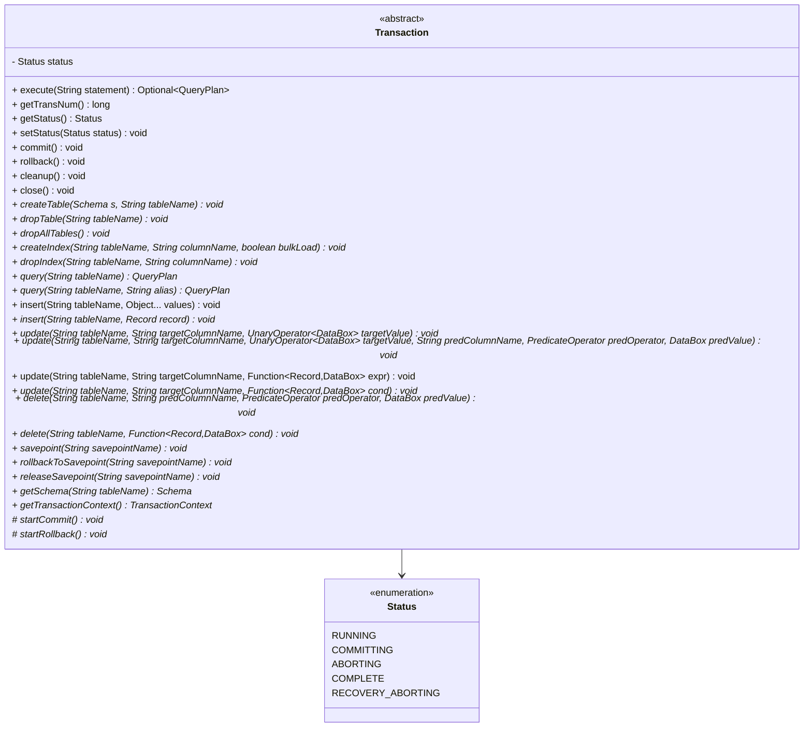
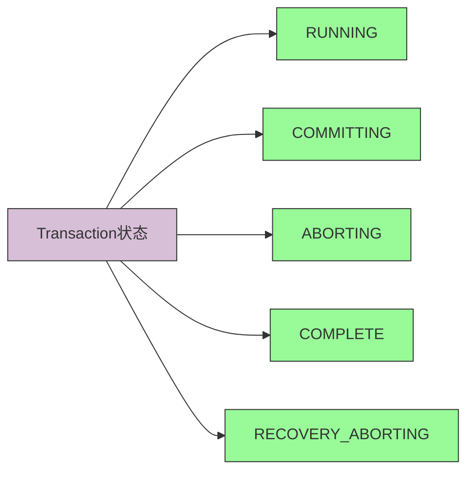
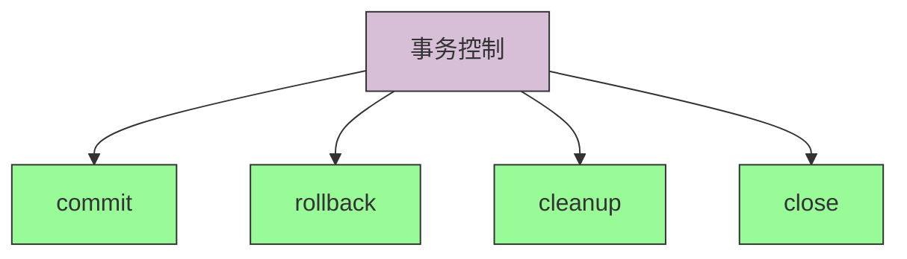
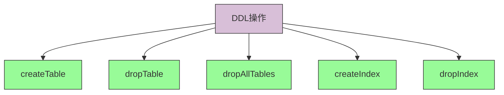
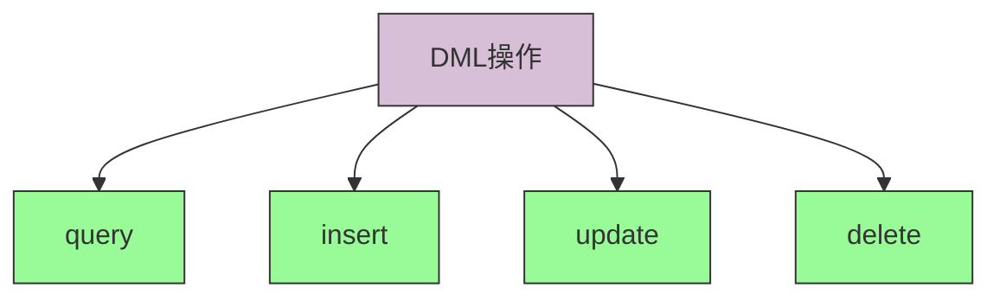
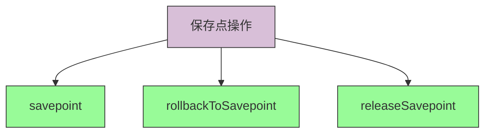

# Transaction API 文档

## Transaction 类结构图



## 核心API说明

### 状态管理



#### 状态枚举

```java
public enum Status {
    RUNNING,              // 运行中
    COMMITTING,           // 提交中
    ABORTING,             // 回滚中
    COMPLETE,             // 完成
    RECOVERY_ABORTING     // 恢复期间的回滚状态
}
```

#### 状态操作方法

1. **getStatus()**
```java
/**
 * @return 事务的当前状态
 */
public final Status getStatus() {
    return status;
}
```

2. **setStatus(Status status)**
```java
/**
 * 设置事务状态。不应由事务使用者直接调用
 *（此方法应由恢复管理器调用）。
 * @param status 事务的新状态
 */
public void setStatus(Status status) {
    this.status = status;
}
```

### 事务控制方法



1. **commit()**
```java
/**
 * 提交事务。等同于
 *      COMMIT
 *
 * 这是事务结束的默认方式。
 */
public final void commit() {
    if (status != Status.RUNNING) {
        throw new IllegalStateException("事务不处于运行状态，无法提交");
    }
    startCommit();
}
```

2. **rollback()**
```java
/**
 * 回滚事务。等同于
 *      ROLLBACK
 *
 * 需要完全实现项目5（恢复）。
 */
public final void rollback() {
    if (status != Status.RUNNING) {
        throw new IllegalStateException("事务不处于运行状态，无法回滚");
    }
    startRollback();
}
```

3. **cleanup()**
```java
/**
 * 清理事务（当事务结束时）。不需要直接调用，
 * 因为commit/rollback应该自己调用cleanup。
 * 多次调用时不会执行任何操作。
 */
public abstract void cleanup();
```

4. **close()**
```java
/**
 * 实现close()作为commit()当未调用abort/commit时 - 以便我们可以编写：
 *
 * try (Transaction t = ...) {
 * ...
 * }
 *
 * 并让事务提交。
 */
@Override
public final void close() {
    if (status == Status.RUNNING) {
        commit();
    }
}
```

### DDL操作方法



#### 表操作

1. **createTable(Schema s, String tableName)**
```java
/**
 * 创建表。等同于
 *      CREATE TABLE tableName (...s)
 *
 * 索引必须在之后使用createIndex创建。
 *
 * @param s 新表的模式
 * @param tableName 新表的名称
 */
public abstract void createTable(Schema s, String tableName);
```

2. **dropTable(String tableName)**
```java
/**
 * 删除表。等同于
 *      DROP TABLE tableName
 *
 * @param tableName 要删除的表名
 */
public abstract void dropTable(String tableName);
```

3. **dropAllTables()**
```java
/**
 * 删除所有普通表。
 */
public abstract void dropAllTables();
```

#### 索引操作

1. **createIndex(String tableName, String columnName, boolean bulkLoad)**
```java
/**
 * 创建索引。等同于
 *      CREATE INDEX tableName_columnName ON tableName (columnName)
 * 在postgres中。
 *
 * 唯一支持的索引是B+树。索引需要完全实现项目2（B+树）。
 * 批量加载还需要完全实现项目3第1部分（连接/排序）。
 *
 * @param tableName 要为其创建索引的表名
 * @param columnName 要在其上创建索引的列名
 * @param bulkLoad 是否批量加载数据
 */
public abstract void createIndex(String tableName, String columnName, boolean bulkLoad);
```

2. **dropIndex(String tableName, String columnName)**
```java
/**
 * 删除索引。等同于
 *      DROP INDEX tableName_columnName
 * 在postgres中。
 *
 * @param tableName 要从中删除索引的表名
 * @param columnName 要从中删除索引的列名
 */
public abstract void dropIndex(String tableName, String columnName);
```

### DML操作方法



#### 查询操作

1. **query(String tableName)**
```java
/**
 * 返回从tableName选择的QueryPlan。等同于
 *      SELECT * FROM tableName
 * 用于所有SELECT查询。
 * @param tableName 要从中选择的表名
 * @return 新的查询计划
 */
public abstract QueryPlan query(String tableName);
```

2. **query(String tableName, String alias)**
```java
/**
 * 返回从tableName选择的QueryPlan。等同于
 *      SELECT * FROM tableName AS alias
 * 用于所有SELECT查询。
 * @param tableName 要从中选择的表名
 * @param alias tableName的别名
 * @return 新的查询计划
 */
public abstract QueryPlan query(String tableName, String alias);
```

#### 插入操作

1. **insert(String tableName, Object... values)**
```java
/**
 * 向表中插入一行。等同于
 *      INSERT INTO tableName VALUES(...values)`
 *
 * @param tableName 要插入的表名
 * @param values 要插入的值。可以是数据库支持的类型序列或
 */
public void insert(String tableName, Object... values) {
    insert(tableName, new Record(values));
}
```

2. **insert(String tableName, Record record)**
```java
/**
 * 向表中插入一行。等同于
 *      INSERT INTO tableName VALUES(...values)
 * 使用`record`中的值
 *
 * @param tableName 要插入的表名
 * @param record 包含要插入值的记录
 */
public abstract void insert(String tableName, Record record);
```

#### 更新操作

1. **update(String tableName, String targetColumnName, UnaryOperator<DataBox> targetValue)**
```java
/**
 * 更新表中的行。等同于
 *      UPDATE tableName SET targetColumnName = targetValue(targetColumnName)
 *
 * @param tableName 要更新的表名
 * @param targetColumnName 要更新的列
 * @param targetValue 将旧值映射到新值的函数
 */
public abstract void update(String tableName, String targetColumnName, UnaryOperator<DataBox> targetValue);
```

2. **update(String tableName, String targetColumnName, UnaryOperator<DataBox> targetValue, String predColumnName, PredicateOperator predOperator, DataBox predValue)**
```java
/**
 * 更新表中的行。等同于
 *      UPDATE tableName SET targetColumnName = targetValue(targetColumnName)
 *       WHERE predColumnName predOperator predValue
 *
 * @param tableName 要更新的表名
 * @param targetColumnName 要更新的列
 * @param targetValue 将旧值映射到新值的函数
 * @param predColumnName WHERE条件中使用的列
 * @param predOperator WHERE条件中使用的运算符
 * @param predValue WHERE条件中使用的值
 */
public abstract void update(String tableName, String targetColumnName, UnaryOperator<DataBox> targetValue,
                           String predColumnName, PredicateOperator predOperator, DataBox predValue);
```

3. **update(String tableName, String targetColumnName, Function<Record, DataBox> expr)**
```java
/**
 * @param tableName 要更新的表名
 * @param targetColumnName 要更新的列
 * @param expr 计算新更新值的表达式
 */
public void update(String tableName, String targetColumnName, Function<Record, DataBox> expr) {
    update(tableName, targetColumnName, expr, (r) -> new BoolDataBox(true));
};
```

4. **update(String tableName, String targetColumnName, Function<Record, DataBox> expr, Function<Record, DataBox> cond)**
```java
/**
 * @param tableName 要更新的表名
 * @param targetColumnName 要更新的列
 * @param expr 计算新更新值的表达式
 * @param cond 根据记录的值评估是否应更新给定记录的表达式
 */
public abstract void update(String tableName, String targetColumnName, Function<Record, DataBox> expr, Function<Record, DataBox> cond);
```

#### 删除操作

1. **delete(String tableName, String predColumnName, PredicateOperator predOperator, DataBox predValue)**
```java
/**
 * 从表中删除行。等同于
 *      DELETE FROM tableNAME WHERE predColumnName predOperator predValue
 *
 * @param tableName 要从中删除的表名
 * @param predColumnName WHERE条件中使用的列
 * @param predOperator WHERE条件中使用的运算符
 * @param predValue WHERE条件中使用的值
 */
public abstract void delete(String tableName, String predColumnName, PredicateOperator predOperator,
                           DataBox predValue);
```

2. **delete(String tableName, Function<Record, DataBox> cond)**
```java
/**
 * @param tableName 要从中删除的表名
 * @param cond 根据其值评估是否应删除给定记录的表达式
 */
public abstract void delete(String tableName, Function<Record, DataBox> cond);
```

### 保存点操作



1. **savepoint(String savepointName)**
```java
/**
 * 创建保存点。事务可以在提交/中止之前的任何时候回滚到它创建的保存点。
 * 等同于
 *      SAVEPOINT savepointName
 *
 * 保存点需要完全实现项目5（恢复）。
 *
 * @param savepointName 保存点名称
 */
public abstract void savepoint(String savepointName);
```

2. **rollbackToSavepoint(String savepointName)**
```java
/**
 * 回滚自给定保存点以来事务所做的所有更改。
 * 等同于
 *      ROLLBACK TO savepointName
 *
 * 保存点需要完全实现项目5（恢复）。
 *
 * @param savepointName 保存点名称
 */
public abstract void rollbackToSavepoint(String savepointName);
```

3. **releaseSavepoint(String savepointName)**
```java
/**
 * 删除保存点。等同于
 *      RELEASE SAVEPOINT
 *
 * 保存点需要完全实现项目5（恢复）。
 *
 * @param savepointName 保存点名称
 */
public abstract void releaseSavepoint(String savepointName);
```

### 其他重要方法

#### 模式获取

**getSchema(String tableName)**
```java
/**
 * @param tableName 要获取模式的表名
 * @return 表的模式
 */
public abstract Schema getSchema(String tableName);
```

#### 内部方法

1. **getTransactionContext()**
```java
/**
 * @return 此事务的事务上下文
 */
public abstract TransactionContext getTransactionContext();
```

2. **startCommit()**
```java
/**
 * 当调用commit()时调用。在此方法中抛出的任何异常都将导致
 * 事务中止。
 */
protected abstract void startCommit();
```

3. **startRollback()**
```java
/**
 * 当调用rollback()时调用。不应抛出异常，任何抛出的异常
 * 都将被解释为方法正常返回。
 */
protected abstract void startRollback();
```

#### 语句执行

**execute(String statement)**
```java
/**
 * 执行一条语句（例如SELECT, UPDATE, INSERT等）
 */
public abstract Optional<QueryPlan> execute(String statement);
```

**getTransNum()**
```java
/**
 * @return 事务编号
 */
public abstract long getTransNum();
```

## 使用示例

```java
// 使用try-with-resources自动提交事务
try (Transaction transaction = database.beginTransaction()) {
    // 创建表
    Schema schema = new Schema()
        .add("id", Type.INT(10))
        .add("name", Type.VARCHAR(50));
    transaction.createTable(schema, "users");
    
    // 插入数据
    transaction.insert("users", 1, "Alice");
    transaction.insert("users", 2, "Bob");
    
    // 查询数据
    QueryPlan query = transaction.query("users");
    query.select("id", PredicateOperator.GREATER_THAN, 1);
    query.project("name");
    
    Iterator<Record> results = query.execute();
    while (results.hasNext()) {
        Record record = results.next();
        System.out.println(record);
    }
    
    // 更新数据
    transaction.update("users", "name", (oldValue) -> new StringDataBox("Charlie", 50), 
                      "id", PredicateOperator.EQUALS, new IntDataBox(2));
    
    // 删除数据
    transaction.delete("users", "id", PredicateOperator.LESS_THAN, new IntDataBox(2));
    
    // 事务会在try块结束时自动提交
}
```