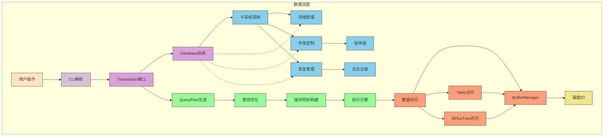

# 数据流图

## 数据流向说明

### Database的协调作用
Database作为核心协调者，负责：
1. 管理和协调所有子系统(DiskSpaceManager、BufferManager、LockManager、RecoveryManager)
2. 处理DDL操作(创建/删除表和索引)
3. 管理事务的元数据信息

### 查询数据流
1. 用户通过CLI输入查询语句
2. CLI解析语句并调用Transaction接口
3. Transaction将请求传递给Database进行协调
4. 对于查询操作，Transaction创建QueryPlan进行查询规划
5. QueryPlan经过优化生成操作符树
6. 执行引擎按操作符树执行查询
7. 通过Table或BPlusTree访问数据
8. 数据访问通过BufferManager进行缓冲区管理
9. 必要时进行磁盘IO操作

### 更新数据流
1. 用户通过CLI输入更新语句
2. CLI解析语句并调用Transaction接口
3. Transaction将请求传递给Database进行协调
4. Database协调LockManager申请所需锁
5. Database协调RecoveryManager记录日志
6. 通过Table或BPlusTree更新数据
7. 更新通过BufferManager写入缓冲区
8. 后台刷新脏页到磁盘

### 事务控制流
- LockManager负责并发控制
- RecoveryManager负责故障恢复